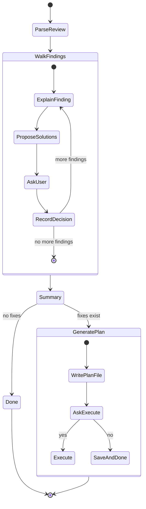

# Design: `/pmp:discuss` Sub-Skill

## Problem

After a plan review or spec-review produces findings, the existing "Discuss" option is free-form — the user asks questions and gets answers, but there's no structured walkthrough. For large reviews with many findings, this makes it easy to miss critical issues or lose track of decisions.

## Solution

A standalone sub-skill (`/pmp:discuss`) that takes a review file, extracts findings sorted by severity, walks through each one interactively, and collects "Fix" decisions into a task list that can be executed via `/pmp:execute`.

## Workflow



### Step 1: Parse Review

- Accept a review file path (plan review or spec-review output)
- Detect review type from file structure (plan review has `Verdict:`, spec-review has `Quality Score:`)
- Extract all findings into a normalized list: `{ severity, title, description, phase/category }`
- Sort by severity: Critical > Important > Minor (within same severity, preserve original order)

### Step 2: Walk Findings (Loop)

For each finding, in severity order:

1. **Explain the issue** — state the finding clearly, include relevant context from the review
2. **Propose 1-2 solutions** — concrete approaches with trade-offs, recommend one
3. **Ask the user** via `AskUserQuestion`:
   - **Acknowledge** — agree with the finding, no action needed (already handled, acceptable risk, etc.)
   - **Fix** — add to the fix task list with the recommended solution (or user's preferred alternative)
   - **Skip** — move on without deciding
   - **Defer** — mark for later consideration

Record the user's decision for each finding.

### Step 3: Summary

After all findings are discussed, present:
```
Discussion complete:
- X findings acknowledged
- Y findings to fix
- Z findings skipped
- W findings deferred
```

### Step 4: Generate Plan (if fixes exist)

If any findings were marked "Fix":
- Generate a plan file at `docs/plans/YYYY-MM-DD-<name>-fixes-plan.md`
- Each fix becomes a feature in the plan (spec change task only — no testing tasks)
- Include deferred items in a "Deferred" section at the bottom for visibility
- Link back to the original review file

Ask the user:
- **Execute now** — invoke `/pmp:execute` on the generated plan
- **Save for later** — write the plan file and stop

## Files

| File | Purpose |
|------|---------|
| `plugins/pmp/skills/discuss/SKILL.md` | Sub-skill entry point with routing metadata |
| `plugins/pmp/skills/discuss/references/discuss.md` | Structured walkthrough algorithm |
| `plugins/pmp/skills/discuss/assets/discuss-plan.md` | Plan template for collected fixes |
| `plugins/pmp/skills/pmp/SKILL.md` | Add discuss route to routing table |

## Design Decisions

- **Standalone sub-skill** — can be invoked on any saved review file, not just during an active review session
- **Severity ordering** — Critical first so the most important issues get attention before context fatigue sets in
- **Fix = task list** — fixes are collected into a plan file with spec change tasks only (no test tasks, since these are spec-level changes), then optionally passed to execute
- **Both review types** — works with plan review output (`review-output.md` format) and spec-review output (`spec-review-output.md` format)
- **Deferred tracking** — deferred findings are recorded in the plan file footer so they're not lost between sessions
