# Arc42 Reorganization

Reorganize spec and architecture files into the arc42 standard structure. Merges duplicated content, flags contradictions, preserves review annotations, and produces a full audit trail.

**Announce at start** with message from [config.md](../../pmp/config.md) Stage Announcements.

## Mindset

You are a technical writer and information architect consolidating a documentation corpus that grew organically over multiple revisions. Your goal is **clarity through standardization** — arc42's 12-section structure, no duplication, one authoritative location for each concept.

### Principles

1. **Arc42 sections as directories** — each output section is a directory with `README.md` + one file per concern
2. **No content loss** — every paragraph from the source must appear in the output (merged, not deleted)
3. **Preserve review annotations** — all `> [!CAUTION]`, `> [!WARNING]`, `> [!NOTE]` blocks must survive intact, attached to their relevant content
4. **Flag contradictions, don't resolve them** — when two sources say conflicting things, include both with a `> [!WARNING]` annotation and let the user decide
5. **Simplify structure** — bias toward fewer, cleaner files within each section directory
6. **File size limit** — no concern file should exceed 500 lines; split large concerns into multiple files by sub-heading
7. **Audit trail** — every piece of content traces back to its source file and section

## Inputs

The user should provide:
- **Spec location**: Directory or file paths containing specifications
- **Optional focus**: Specific subset to reorganize (e.g., "just the auth specs")

If not provided, ask:
```
To reorganize your spec files into arc42 structure, I need:
1. Where are the spec files? (e.g., specs/, docs/architecture/)
2. Should I reorganize everything, or focus on a specific area?
```

## Process

```mermaid
stateDiagram-v2
    [*] --> Discovery
    Discovery --> Analysis
    Analysis --> Proposal
    Proposal --> Execution
    Execution --> Verification

    state Discovery {
        [*] --> MapCorpus
        MapCorpus --> ClassifyFiles
        ClassifyFiles --> CheckCache
        CheckCache --> ReadFiles
        ReadFiles --> [*]
    }

    state Analysis {
        [*] --> ClassifyContent
        ClassifyContent --> DetectDuplicates
        DetectDuplicates --> DetectContradictions
        DetectContradictions --> DesignStructure
        DesignStructure --> [*]
    }

    state Proposal {
        [*] --> PresentPlan
        PresentPlan --> AskUser
        AskUser --> AdjustPlan : user adjusts
        AdjustPlan --> PresentPlan
        AskUser --> Approved : user approves
        AskUser --> Abort : user rejects
        Approved --> [*]
        Abort --> [*]
    }

    state Execution {
        [*] --> CreateDirectories
        CreateDirectories --> CreateFiles
        CreateFiles --> AddCrossRefs
        AddCrossRefs --> CreateIndex
        CreateIndex --> CleanUp
        CleanUp --> [*]
    }

    state Verification {
        [*] --> CheckContentCoverage
        CheckContentCoverage --> CheckAnnotations
        CheckAnnotations --> CheckCrossRefs
        CheckCrossRefs --> ProduceReport
        ProduceReport --> [*]
    }
```



---

### Phase 1: Discovery

1. **Map the corpus**
   - List all files in the provided location(s)
   - Identify file types (markdown, YAML frontmatter, plain text)
   - Note any existing README or index files
   - Record total file count and word count per file

2. **Classify files**
   - **Spec files**: Markdown documents defining system behavior, architecture, APIs (reorganization targets)
   - **Reference material**: Schemas, config files, diagrams, images (preserve as-is, don't reorganize)
   - **Meta files**: READMEs, indexes, tables of contents (will be regenerated)

3. **Check analysis cache (MANDATORY)** — see [analysis-cache.md](../../pmp/references/analysis-cache.md)
   - Check for `docs/.cache/arc42/manifest.json`
   - If manifest exists: hash each file, compare, load cached summaries for unchanged files
   - If no manifest: read all files, build cache afterward
   - Report cache status: `X cached, Y changed, Z new, W deleted`

4. **Read files** (full read on cold cache, changed/new only on warm cache)
   - Read every uncached spec file
   - After reading, produce a structured summary per file using the extraction template (see below)
   - Write summaries to `docs/.cache/arc42/summaries/`

---

### Phase 2: Analysis

All analysis runs in the main controller context. Do NOT spawn agents for analysis.

Read [arc42-guide.md](arc42-guide.md) for section definitions, content classification patterns, and per-section tips before classifying.

#### 2a. Classify Content into Arc42 Sections

For each section (heading-delimited block) across all files, assign an **arc42 section number** (1-12) using the content classification guide in [arc42-guide.md](arc42-guide.md).

Within each arc42 section, identify distinct **concerns** — logical groupings of content that should become separate files. For example, within Section 5 (Building Block View): "authentication module", "data model", "API gateway" are separate concerns.

Build a **section assignment table**:

| Source File | Source Section | Arc42 Section | Concern | Word Count | Est. Lines |
|-------------|---------------|---------------|---------|------------|------------|
| [file] | [heading] | [1-12] | [concern name] | [count] | [lines] |

Content that doesn't map to any arc42 section → assign to section `99` (Appendix).

Estimate lines per concern: `Est. Lines ≈ Word Count / 5` (accounts for headings, lists, code blocks, and whitespace).

Report the assignment table to the user.

#### 2b. Detect Duplicates and Overlaps

Identify content that appears in multiple places:
- **Exact duplicates**: Same content (or near-identical) in multiple files
- **Semantic duplicates**: Different wording describing the same concept, behavior, or requirement
- **Partial overlaps**: One file covers a subset of what another file covers

For each duplicate/overlap: `{ type, content_summary, locations: [file:section, file:section], recommended_action: keep_from | merge }`

#### 2c. Detect Contradictions

Identify conflicting statements:
- Different values for the same parameter or threshold
- Conflicting behavioral descriptions
- Inconsistent terminology for the same concept
- Mutually exclusive requirements

For each contradiction: `{ description, location_a: file:section, statement_a, location_b: file:section, statement_b, severity: critical|important|minor }`

**Do NOT resolve contradictions.** Flag them for user decision during the proposal phase.

#### 2d. Design Target Structure

Build the target directory structure:

```
<target-dir>/
├── README.md                          ← Master index linking to all sections
├── 01-introduction-and-goals/
│   ├── README.md                      ← Section overview + index
│   ├── <concern-a>.md
│   └── <concern-b>.md
├── 05-building-block-view/
│   ├── README.md
│   ├── authentication.md
│   ├── data-model.md
│   └── api-gateway.md
├── 08-crosscutting-concepts/
│   ├── README.md
│   ├── security.md
│   ├── error-handling.md
│   └── logging.md
└── ...                                ← Only sections with content
```

Rules:
- Only create directories for arc42 sections that have content
- One file per concern within each section directory
- Descriptive filenames: `<concern-slug>.md` (e.g., `authentication.md`, `data-model.md`)
- **All links to section directories MUST include `README.md`** — use `[Section Name](NN-section-name/README.md)`, never `[Section Name](NN-section-name/)`. Directory-only links break in most renderers.
- Preserve the parent directory location (reorganize within the same root)

#### File Splitting Rules

When a concern's estimated line count exceeds **500 lines**, split it into multiple files within the same section directory:

1. **Identify split boundaries** — use the concern's top-level sub-headings (`##` within the concern) as split points. Each sub-heading group becomes its own file.

2. **Naming convention** — flat files with pattern `<concern>-<sub-topic>.md`:
   ```
   05-building-block-view/
   ├── README.md
   ├── authentication-overview.md        ← split from authentication
   ├── authentication-flows.md           ← split
   ├── authentication-token-management.md ← split
   ├── data-model.md                     ← not split (under 500 lines)
   └── api-gateway.md
   ```

3. **Overview file** — the first split file (`<concern>-overview.md`) starts with a navigation index:
   ```markdown
   ## Authentication

   > This concern is split across multiple files:
   > - [Overview](authentication-overview.md) (this file)
   > - [Authentication Flows](authentication-flows.md)
   > - [Token Management](authentication-token-management.md)
   ```

4. **Section README grouping** — list split files grouped under their parent concern:
   ```markdown
   ## Contents
   - **Authentication**
     - [Overview](authentication-overview.md)
     - [Flows](authentication-flows.md)
     - [Token Management](authentication-token-management.md)
   - [Data Model](data-model.md)
   ```

5. **Minimum split size** — don't create split files under 50 lines. Merge small sub-heading sections with adjacent ones.

6. **Fallback** — if the concern has no `##` sub-headings, split at ~400-line paragraph boundaries: `<concern>-part-1.md`, `<concern>-part-2.md`.

#### 2e. Handle Special Content

- **Review annotations** (`> [!CAUTION]`, `> [!WARNING]`, `> [!NOTE]`): Keep attached to their surrounding content. When content moves, the annotation moves with it.
- **YAML frontmatter**: Preserve if present in source files. The target file gets merged frontmatter (union of fields, flagging conflicts).
- **Cross-references**: Links between source files that reference each other by path will need updating. Track all internal links for the cross-reference pass. See **Cross-Reference Format Rules** below.
- **Images and diagrams**: If files reference images, note the references but don't move image files.

##### Cross-Reference Format Rules

All links between arc42 files MUST use **relative paths** from the file containing the link. Never use absolute paths or root-relative paths.

| From | To | Format |
|------|----|--------|
| Master `README.md` | Section overview | `[Section Name](NN-section-name/README.md)` |
| Section `README.md` | Master index | `[← Back to overview](../README.md)` |
| Section `README.md` | Concern file in same section | `[Concern](concern-name.md)` |
| Concern file | Section overview (same section) | `[← Back to section](README.md)` |
| Concern file | Concern file in **same** section | `[Other Concern](other-concern.md)` |
| Concern file | Concern file in **different** section | `[Other Concern](../NN-section-name/other-concern.md)` |
| Concern file | Section overview in **different** section | `[Section Name](../NN-section-name/README.md)` |
| Any file | Specific heading in another file | Append `#heading-slug` to the path (e.g., `[Auth Flow](../06-runtime-view/authentication-flow.md#token-refresh)`) |
| Split file | Other split file in **same** concern | `[Sub-Topic](concern-sub-topic.md)` |
| Split file | Overview file of same concern | `[← Concern Overview](concern-overview.md)` |

**Rules:**
- Always use relative paths (`../`) — never absolute paths from repo root
- Always include the filename — never link to a bare directory
- Heading anchors use GitHub-style slugs: lowercase, spaces → hyphens, strip punctuation (e.g., `## Quality Goals` → `#quality-goals`)
- When source content had a cross-reference to another source file, rewrite it to the new target path where that content landed
- When merging content creates new implicit relationships (e.g., a concept in Section 5 references a term defined in Section 12), add cross-reference links

---

### Phase 3: Proposal

Present the reorganization plan to the user. Use the [reorganization-report.md](../assets/reorganization-report.md) template.

The proposal MUST include:

1. **Current inventory** — table of all source files with word counts and arc42 section assignments
2. **Proposed structure** — directory tree showing all section directories and concern files
3. **Content movement map** — for each source file, where each section goes
4. **Duplicates to merge** — list of duplicates with the recommended source to keep
5. **Contradictions requiring resolution** — list with both statements, requiring user decision
6. **Files to delete** — source files that will be fully consumed into target structure
7. **Files unchanged** — reference material, schemas, etc. that won't be touched

For contradictions, ask the user which version to keep (or to write a reconciled version).

Use AskQuestion with these options:
- **Approve** — proceed with reorganization as presented
- **Adjust** — user suggests changes to the proposed structure
- **Abort** — cancel the reorganization

If **Adjust**: incorporate the user's changes and re-present the proposal. Loop until Approve or Abort.

If **Abort**: stop. Report "Reorganization cancelled. No files were modified."

---

### Phase 4: Execution

After approval, execute the reorganization. Process one section directory at a time.

#### 4a. Create Section Directories

For each arc42 section that has content:

1. **Create the directory**: `NN-section-name/`

2. **Create the section README.md** with:
   - A navigation link back to the master index: `[← Back to overview](../README.md)`
   - Section title (from arc42)
   - Arc42 subsection guidance and tips (from [arc42-guide.md](arc42-guide.md))
   - Index of concern files within the directory
   - Provenance comment: `<!-- Arc42 reorganization on YYYY-MM-DD -->`

#### 4b. Create Concern Files

For each concern file within a section directory:

1. **Write the header**: Title heading matching the concern name, plus provenance:
   ```markdown
   <!-- Consolidated from: source-a.md, source-b.md on YYYY-MM-DD -->
   ```

2. **Assemble content in logical order**:
   - Group sub-topics within the concern
   - Place the most authoritative/complete version first
   - Remove exact duplicates (keep one copy)
   - For semantic duplicates, merge into a single coherent section with a note:
     ```markdown
     <!-- Merged from: source-a.md#Section-Name, source-b.md#Section-Name -->
     ```

3. **Structure content following arc42 tips** from [arc42-guide.md](arc42-guide.md):
   - Section 1: Use subsections for Requirements Overview, Quality Goals, Stakeholders
   - Section 5: Use hierarchical levels (Level 1, 2, 3+) with black/white box descriptions
   - Section 6: Use named scenarios with step lists or sequence diagrams
   - Section 9: Use ADR format (Title, Context, Decision, Status, Consequences)
   - Section 10: Use quality scenario format (source, stimulus, environment, response, measure)
   - Section 12: Use table format (Term, Definition)

4. **Preserve review annotations**: Every `> [!CAUTION]`, `> [!WARNING]`, `> [!NOTE]` block must appear in the output, attached to the content it annotated in the source.

5. **Insert contradiction markers** for unresolved contradictions:
   ```markdown
   > [!WARNING]
   > **Contradiction (unresolved):** [description]. Source A ([file:section]) says "[statement A]". Source B ([file:section]) says "[statement B]".
   ```

6. **Update internal cross-references**: Rewrite any `[text](old-path.md)` or `[text](old-path.md#section)` links to point to the new file locations. When linking to a section directory, always link to its `README.md` (e.g., `[Building Block View](05-building-block-view/README.md)`) — never use bare directory paths.

7. **Handle split files**: When writing a concern marked for splitting in Phase 2d:
   - Create each split file with standard header, provenance, content assembly, annotations, and cross-references
   - Add the concern navigation index to the overview file (first split file)
   - Ensure cross-references between split files use relative paths within the same directory
   - Each split file's provenance comment lists only the source sections it contains

#### 4c. Create Master Index

Create a top-level `README.md` in the target directory:

```markdown
# [Project/System Name] — Architecture Documentation

Organized following the [arc42](https://arc42.org) template.

## Contents

| # | Section | Description |
|---|---------|-------------|
| 1 | [Introduction & Goals](01-introduction-and-goals/README.md) | [1-sentence description] |
| 5 | [Building Block View](05-building-block-view/README.md) | [1-sentence description] |
| ... | | |

---

*Reorganized on YYYY-MM-DD from N source files using `/pmp:arc42`.*
```

#### 4d. Clean Up Source Files

- Delete source files that have been fully consumed into the target structure
- If a source file had content split across multiple target directories AND some content was reference material that stayed in place, leave the reference material file intact
- Do NOT delete files classified as "reference material" or "unchanged"

---

### Phase 5: Verification

#### 5a. Content Coverage Check

For every section tracked in the content map:
- Verify the section appears in the correct target file
- Verify review annotations survived
- Report: `X/Y sections verified (Z annotations preserved)`

If any section is missing, report it as an error and offer to fix.

#### 5b. Cross-Reference Check

For every internal link in the target files:
- Verify the link target exists
- Report broken links

#### 5c. Produce Summary Report

Present to the user:

```
## Reorganization Complete

| Metric | Value |
|--------|-------|
| Source files processed | N |
| Arc42 section directories created | M |
| Concern files created | F |
| Source files removed | K |
| Sections moved | S |
| Duplicates merged | D |
| Contradictions flagged | C |
| Review annotations preserved | A |
| Concerns split (>500 lines) | S |
| Broken cross-references | B |

### Arc42 Structure Created
- [list of section directories with file counts]

### Files Removed
- [list of deleted source files]

### Contradictions Still Unresolved
- [any remaining contradictions]
```

---

## Extraction Template (for Analysis Cache)

When generating a summary for a cached file, extract:

```markdown
## Arc42 Classification
- [for each heading-delimited section: heading, arc42 section number (1-12 or 99), concern name, word count]

## Key Concepts
- [main concepts, terms, and definitions in this file]

## Cross-References
- [links to other spec files, shared concepts]

## Review Annotations
- [count and list of [!CAUTION], [!WARNING], [!NOTE] blocks with their associated content summary]

## Content Fingerprints
- [for each major section: a 1-sentence content summary to detect semantic duplicates across files]
```

---

## Corpus Size

- **Under 30 files**: Process normally
- **30-60 files**: Warn user that context may be tight; suggest focusing on a subdirectory
- **Over 60 files**: Require user to specify focus areas or subdirectories; refuse to reorganize entire corpus in a single pass

---

## Context Management

**All analysis phases run in the main controller context — do NOT spawn agents for analysis.**

Agents share no context with the main controller. Spawning agents for analysis forces each agent to re-read all files, multiplying token cost. Instead:

- **Phase 1 (Discovery):** Use parallel agents ONLY for reading files when the corpus is large (10+ files). Each agent reads a partition of files and returns the content.
- **Phase 2 (Analysis):** Run in the main controller. The controller already has all file contents from Phase 1.
- **Phase 4 (Execution):** Can use agents to write files in parallel if the target structure is large.

---

## Constraints

- **DO NOT** silently resolve contradictions — always flag them for user decision
- **DO NOT** delete reference material (schemas, ADRs, config files)
- **DO NOT** move files outside the original parent directory without user approval
- **DO NOT** modify content semantics — reorganization is structural, not editorial
- **DO NOT** skip the proposal phase — always get user approval before modifying files
- **DO** preserve every review annotation
- **DO** produce provenance comments so changes can be audited
- **DO** update all internal cross-references
- **DO** track progress with TodoWrite throughout
