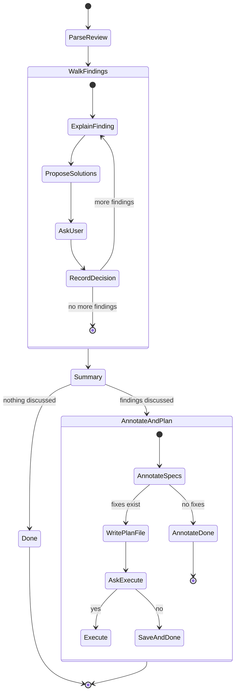

# Discuss Review Findings

Structured walkthrough of review findings. Reads a review file, extracts findings by severity, walks through each one interactively, and collects fix decisions into an executable plan.

**Announce at start** with message from [config.md](../../pmp/config.md) Stage Announcements.

## Inputs

The user should provide:
- **Review file**: Path to a plan review or spec-review output file

If not provided, ask:
```
To walk through review findings, I need:
1. Path to the review file (e.g., docs/reviews/2026-03-14-auth-gateway-review.md)
```

Check `docs/reviews/` for recent review files if the user doesn't specify one.

## Process



---

### Step 1: Parse Review

1. **Read the review file** completely
2. **Detect review type** from structure:
   - **Plan review** — contains `### Verdict:` and `### Issues Found` with Critical/Important/Minor subsections
   - **Spec-review** — contains `## Executive Summary` with `Architecture quality score:` and multiple analysis tables with Severity/Risk columns
3. **Extract findings** into a normalized list

#### Finding Extraction: Plan Review

Extract from the `### Issues Found` section:

- `#### Critical (must fix)` → severity: Critical
- `#### Important (should fix)` → severity: Important
- `#### Minor (nice to have)` → severity: Minor

Also extract from:
- `### Security Analysis` → any STRIDE findings with severity
- `### Missing Items` → treat as severity: Important

Each finding: `{ severity, title, description, source_section }`

#### Finding Extraction: Spec-Review

Extract from **every analysis table** that has a Severity, Risk, or Priority column. The tables are:

| Section | Severity Source |
|---------|----------------|
| Simplification Opportunities | Infer from Effort (High effort = Important, Low = Minor) |
| Component Boundary Issues | Infer Important (all are structural) |
| Consistency Problems | Important |
| Determinism Issues | Risk column |
| Configuration Model Issues | Risk column |
| Invariant Violations | Infer from Consequence (Critical if security/data loss, Important otherwise) |
| State Machine Issues | Risk column |
| Threat Model Findings | Severity column |
| Attack Simulation Results | Severity field |
| Performance & Optimization | Infer Important |
| Resource Utilization Risks | Infer from Impact (unbounded = Critical, bounded = Important) |
| Failure Mode Weaknesses | Severity column |
| Observability Gaps | Minor |
| Scalability Risks | Important |
| Maintainability Problems | Minor |
| AI Red Team tables (if present) | Severity columns |
| Recommended Architectural Improvements | Priority column (1-3 = Critical, 4-6 = Important, 7+ = Minor) |

Each finding: `{ severity, title, description, source_section, recommendation }`

#### Sorting

Sort all extracted findings:
1. **Critical** first
2. **Important** second
3. **Minor** last

Within the same severity, preserve the order they appeared in the review.

---

### Step 2: Walk Findings

Present a progress header before each finding:

```
## Finding [N] of [total] — [Severity]
```

For each finding:

#### 2a. Explain the Issue

State the finding clearly. Include:
- What the problem is
- Where it occurs (component, section, boundary)
- Why it matters (impact, risk)
- Relevant context from the review

Keep explanations concise — 3-5 sentences. The review already has the full analysis; this is about making it actionable.

#### 2b. Propose Solutions

Propose **1 or more concrete solutions**:
- Lead with your recommended approach and explain why
- For each solution: what to change in the spec/plan, trade-offs, effort estimate
- **Evaluate complexity impact** — for every proposed solution, explicitly assess whether it adds complexity to the system. If a solution introduces new abstractions, configuration, or moving parts, call it out
- **Bias toward simplification** — if a finding can be resolved by removing something (a redundant check, an unnecessary abstraction, an over-engineered pattern), that is almost always the better solution. The best fix often makes the system simpler, not more complex
- Be specific — "add a timeout to the upstream call" not "consider adding timeouts"

#### 2c. Ask the User

Use `AskQuestion` with these options:

- **Acknowledge** — "Agree with finding, no spec change needed" (already handled, acceptable risk, out of scope)
- **Fix** — "Add to fix list" (uses the recommended solution, or user can specify an alternative)
- **Skip** — "Move on without deciding"
- **Defer** — "Mark for later consideration"

If the user picks **Fix** and wants a different solution than recommended, ask them to describe their preferred approach before recording it.

#### 2d. Record Decision

Track each decision:
```
{ finding_number, severity, title, decision: acknowledge|fix|skip|defer, solution: <text if fix> }
```

Also offer a **Done** escape hatch — user can say "done" at any point to stop the walkthrough early and proceed to summary.

---

### Step 3: Summary

After all findings are addressed (or user says "done"), present:

```
## Discussion Summary

| Decision | Count |
|----------|-------|
| Acknowledged | X |
| Fix | Y |
| Skipped | Z |
| Deferred | W |
| Not discussed | V (if stopped early) |

### Findings to Address
1. [Title] — [solution summary]
2. ...

### Deferred
1. [Title] — [reason if given]
2. ...
```

---

### Step 4: Annotate Specs and Generate Plan

Run this step if **any** findings were discussed (Fix, Acknowledge, or Skip — at least one finding resolved).

#### 4a. Annotate Spec Files (Acknowledged and Skipped findings)

For each finding marked **Acknowledge** or **Skip**:

1. **Identify the spec file** where the finding originates (from the `source_section` and recommendation in the finding)
2. **Locate the relevant section** in the spec file (the paragraph, table, or heading the finding refers to)
3. **Insert a GitHub blockquote alert immediately after** the relevant section:

   For **Critical severity Acknowledged** findings:
   ```markdown
   > [!CAUTION]
   > **Reviewed YYYY-MM-DD:** [finding title] — **Acknowledged:** [user's reason]
   ```

   For **non-Critical Acknowledged** findings:
   ```markdown
   > [!WARNING]
   > **Reviewed YYYY-MM-DD:** [finding title] — **Acknowledged:** [user's reason]
   ```

   For **Skipped** findings:
   ```markdown
   > [!NOTE]
   > **Reviewed YYYY-MM-DD:** [finding title] — **Skipped:** [user's reason or "No reason given"]
   ```

4. If the finding refers to **missing content** (not a specific section), place the annotation at the top of the most relevant spec file, after any frontmatter and the first heading

#### 4b. Generate Plan File (if any findings marked Fix)

If any findings were marked **Fix**:

1. Generate a plan file using [discuss-plan.md](../assets/discuss-plan.md) template
2. **CRITICAL — Plan file naming:** Save to `docs/plans/` using the Write tool with an **explicit filename**. The filename MUST follow this exact pattern:

   ```
   docs/plans/YYYY-MM-DD-<review-name>-findings-plan.md
   ```

   Where `<review-name>` is derived from the review file's name (e.g., review file `2026-03-14-auth-gateway-review.md` produces plan `2026-03-14-auth-gateway-findings-plan.md`).

   **DO NOT** use Claude Code's auto-generated plan names (like `quirky-strolling-harbor.md`). **DO NOT** use plan mode to create this file. Use the Write tool directly with the full path.

3. Each finding marked **Fix** becomes a **Feature** in the plan — spec/doc change only, no test tasks
4. Include **Deferred** findings in the `## Deferred` section
5. Include **Acknowledged** and **Skipped** findings in the `## Acknowledged & Skipped` section (audit trail — these are already annotated in the spec files from step 4a)

Ask the user via `AskQuestion`:

- **Execute now** — tell the user to invoke `/pmp:execute` on the generated plan
- **Save for later** — plan file is written, done

#### 4c. No-Fix Path (all findings Acknowledged/Skipped/Deferred)

If **no** findings were marked Fix (all were Acknowledged, Skipped, or Deferred):

1. Still annotate spec files per step 4a above
2. **Do NOT** generate a plan file (no spec changes to execute)
3. Report: "All findings were resolved without spec changes. Annotations have been added to the spec files."

---

## Constraints

- **DO NOT** modify the review file during discussion — it is read-only during this stage. The execute skill will update it with a `## Resolution` section after plan execution completes.
- **DO NOT** skip the AskQuestion step — every finding gets a user decision
- **DO NOT** auto-advance past Summary — always ask before generating a plan
- **DO NOT** skip findings of any severity — walk through ALL findings: Critical, Important, AND Minor. Every finding gets discussed, no matter how small. The user decides what to act on, not you.
- **DO NOT** use Claude Code plan mode or auto-generated filenames for the findings plan — always use the Write tool with the explicit `YYYY-MM-DD-<review-name>-findings-plan.md` path
- **DO** annotate spec files for ALL Acknowledged and Skipped findings — this prevents them from resurfacing in future spec-review runs
- **DO** include ALL findings in the plan file (Fix as Features, Acknowledged/Skipped in audit trail table, Deferred in deferred table) — nothing should be lost
- **DO** respect the user saying "done" at any point to stop the walkthrough
- **DO** track decisions accurately — the plan file must match what the user decided
