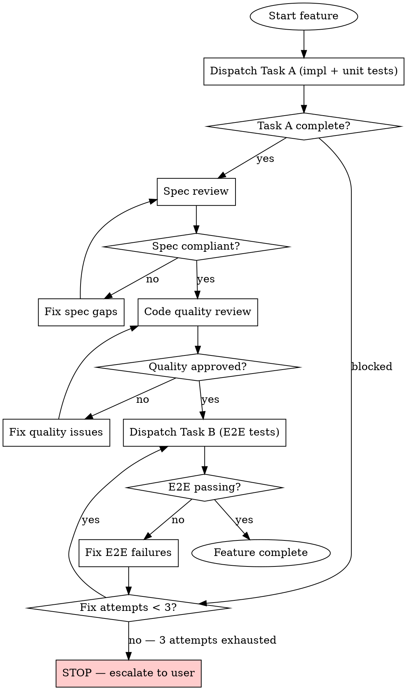

# PMP: Execute

**Announce at start:** "Using pmp:execute to implement this plan."

Implements plans using a two-task model: Task A (implementation + unit tests) and Task B (E2E tests) per feature. Manages agent teams, fix loops, CI gates, and PR creation.

Use agent teams (Task tool) and track progress with TodoWrite throughout.

## When NOT to Use

- No plan exists yet → use pmp:plan first
- Plan hasn't been reviewed → use pmp:plan-review first
- User wants to explore approaches → use pmp:brainstorm
- User wants to review specs, not execute a plan → use pmp:spec-review

## Per-Feature Loop



## Iron Laws

### Verification Gate

```
NO COMPLETION CLAIMS WITHOUT FRESH VERIFICATION EVIDENCE
```

**Violating the letter of this rule is violating the spirit of this rule.**

BEFORE claiming any status:
1. IDENTIFY: What command proves this claim?
2. RUN: Execute the FULL command (fresh, complete)
3. READ: Full output, check exit code, count failures
4. VERIFY: Does output confirm the claim?
   - If NO: State actual status with evidence
   - If YES: State claim WITH evidence
5. ONLY THEN: Make the claim

Skip any step = lying, not verifying.

| Excuse | Reality |
|--------|---------|
| "Should work now" | RUN the verification |
| "I'm confident" | Confidence ≠ evidence |
| "Agent said success" | Verify independently |
| "Linter passed" | Linter ≠ compiler ≠ tests |
| "Partial check is enough" | Partial proves nothing |

### Fix Loop Ceiling

```
3 FIX ATTEMPTS MAXIMUM — THEN STOP AND ESCALATE
```

| Excuse | Reality |
|--------|---------|
| "One more attempt will fix it" | You said that before attempt 3 |
| "I'm close" | 3 failures = wrong approach, not almost right |
| "Different fix this time" | Different symptom fix ≠ root cause fix |

### Context Hygiene

```
BATCH CONTROLLERS EVERY 3 FEATURES — FRESH CONTEXT FOR EACH BATCH
```

| Excuse | Reality |
|--------|---------|
| "I can fit one more feature" | Context exhaustion fails silently — you won't notice until quality degrades |
| "The features are small" | Small features still accumulate subagent returns, tool outputs, file reads |
| "Starting a new batch is wasteful" | A degraded controller produces bad code. Fresh context is cheap. |

### No Auto-Advance

```
NO STAGE TRANSITIONS WITHOUT EXPLICIT USER CONFIRMATION
```

Always ask before transitioning. Use AskQuestion. Never auto-advance.

## When to Stop and Ask

**STOP executing immediately when:**
- Hit a blocker mid-batch
- Plan has critical gaps preventing correct implementation
- You don't understand an instruction
- Verification fails repeatedly (3 attempts)

**Ask for clarification rather than guessing.**
**Don't force through blockers — stop and ask.**

## Common Mistakes

| Mistake | Problem | Fix |
|---------|---------|-----|
| Skipping spec review because "implementation looks correct" | Over/under-builds vs plan | Always run spec review after Task A |
| Running Task B before Task A's reviews pass | E2E tests built on bad foundation | Spec review ✅ → code review ✅ → THEN Task B |
| Letting subagent return prose instead of structured format | Context exhaustion | Demand FILES/TESTS/COMMIT/ISSUES/BLOCKED format |
| Continuing after 3 fix failures | Wrong approach, not almost right | Escalate to user |
| Committing without running CI gate | Broken builds | Run detected CI command before every commit |

## Red Flags — STOP

- About to claim "tests pass" without running them
- About to skip review because "it's a small change"
- Subagent said "success" — did you verify independently?
- Using "should", "probably", "seems to" about status
- On fix attempt #3 — escalate, don't try #4
- Context feels bloated — batch-split now
- Raw test output in controller window (use `--tb=short`, `--reporter=dot`)

## Workflow

1. **REQUIRED:** Read [config.md](../pmp/config.md) for current constants — especially the Context Management section
2. **REQUIRED:** Read [execute-loop.md](references/execute-loop.md) and follow it completely — it contains setup, per-feature loops, batch controllers, fix loops, review, completion, Test Only Mode, and multi-session resume

## References

- Implementer prompt: [implementer-prompt.md](references/implementer-prompt.md)
- Spec reviewer prompt: [spec-reviewer-prompt.md](../pmp/references/spec-reviewer-prompt.md)
- Code quality reviewer: [code-quality-reviewer-prompt.md](references/code-quality-reviewer-prompt.md)
- PR body template: [pr-body.md](assets/pr-body.md)
- E2E test spec template: [e2e-test-spec.md](assets/e2e-test-spec.md)

## Shared Resources

- Testing approaches: [testing-approaches.md](../pmp/references/testing-approaches.md)
- **BACKGROUND:** [overview.md](../pmp/references/overview.md) for lifecycle context
