# Execute Loop

Implements features from the plan in a two-task model: Task A (implementation + unit tests) and Task B (E2E tests). Each task gets its own commit, halving the per-task workload while preserving full E2E coverage.

```mermaid
stateDiagram-v2
    [*] --> Setup

    state Setup {
        [*] --> ReadPlan
        ReadPlan --> CheckoutBranch
        CheckoutBranch --> CheckGHIssues
        CheckGHIssues --> SetupInfra
        SetupInfra --> VerifyRunner
        VerifyRunner --> InfraFailed : runner fails
        VerifyRunner --> Ready : runner works
        InfraFailed --> [*] : STOP — ask user
        Ready --> [*]
    }

    Setup --> FeatureN : for each feature in dependency order

    state FeatureN {
        [*] --> TaskA

        state TaskA {
            [*] --> Implement
            Implement --> RunUnitTests
            RunUnitTests --> UnitFixLoop : unit tests fail
            RunUnitTests --> CommitImpl : all pass

            state UnitFixLoop {
                [*] --> ParseUnitFailure
                ParseUnitFailure --> ClassifyUnit
                ClassifyUnit --> FixUnitImpl
                FixUnitImpl --> RerunUnit
                RerunUnit --> UnitCounter
                UnitCounter --> [*] : tests pass
                UnitCounter --> ParseUnitFailure : < ceiling
                UnitCounter --> UnitBlocked : ceiling reached
            }

            UnitFixLoop --> CommitImpl : tests pass
            UnitFixLoop --> AskUser : blocked

            CommitImpl --> RunCI_A
            RunCI_A --> TaskADone : CI pass
            RunCI_A --> FixCI_A : CI fail
            FixCI_A --> RunCI_A
            TaskADone --> [*]
        }

        TaskA --> TaskB

        state TaskB {
            [*] --> WriteE2E
            WriteE2E --> RunAllE2E

            RunAllE2E --> E2EFixLoop : any test fails
            RunAllE2E --> CommitE2E : all pass

            state E2EFixLoop {
                [*] --> ParseE2EFailure
                ParseE2EFailure --> ClassifyE2E
                ClassifyE2E --> FixE2EImpl : DETERMINISTIC BUG
                ClassifyE2E --> FixE2ETest : FLAKY
                ClassifyE2E --> FixE2EBoth : SPEC MISMATCH
                ClassifyE2E --> RestartInfra : INFRASTRUCTURE

                FixE2EImpl --> RerunE2E
                FixE2ETest --> RerunE2E
                FixE2EBoth --> RerunE2E
                RestartInfra --> RerunE2E

                RerunE2E --> E2ECounter
                E2ECounter --> [*] : tests pass
                E2ECounter --> ParseE2EFailure : < ceiling
                E2ECounter --> E2EBlocked : ceiling reached
            }

            E2EFixLoop --> CommitE2E : tests pass
            E2EFixLoop --> AskUser : blocked

            CommitE2E --> RunCI_B
            RunCI_B --> Review : CI pass
            RunCI_B --> FixCI_B : CI fail
            FixCI_B --> RunCI_B
            Review --> TaskBDone
            TaskBDone --> [*]
        }

        TaskB --> FeatureDone
        FeatureDone --> [*]
    }

    FeatureN --> FeatureN : next feature
    FeatureN --> Completion : all features done

    state Completion {
        [*] --> FinalE2ERun
        FinalE2ERun --> FinalCI
        FinalCI --> PrintResults
        PrintResults --> AskPR
        AskPR --> CreatePR : user says yes
        AskPR --> UpdateFrontmatter : user says no
        CreatePR --> PRClosesIssues : GH issues exist (Closes #N in body)
        CreatePR --> UpdateFrontmatter : no GH issues
        PRClosesIssues --> UpdateFrontmatter
        UpdateFrontmatter --> ArchivePlan : move to docs/plans/implemented/
        ArchivePlan --> UpdateReview : if source_review exists
        ArchivePlan --> [*] : no source_review
        UpdateReview --> [*]
    }

    Completion --> [*] : done
```



## E2E Principles

These principles apply across all execution models:

- **Specs, not code:** Plans describe WHAT to build/test, never HOW (no code snippets)
- **Structural traceability:** Every AC has its E2E test case directly beneath it — no cross-references needed
- **Two-stage commits:** Implementation commits after unit/integration tests pass. E2E test commits after E2E tests pass. Each feature produces two commits.
- **Fix loop ceiling:** see [config.md](../../pmp/config.md) Thresholds for max attempts per feature
- **Test isolation:** Each feature's tests handle their own setup/teardown, runnable independently
- **No hardcoded conventions:** Integration branch, CI command, test directory all come from project detection (recorded in the plan header)

---

## Context Management

Read [config.md](../../pmp/config.md) Context Management before starting. The rules below are critical for preventing context window exhaustion during execution.

### Batch Controllers

Do NOT execute the entire plan in a single controller session. Split features into batches of **3** (see config.md Max features per controller session). Each feature has two tasks (Task A: implementation, Task B: E2E tests), so each batch contains up to 6 tasks.

**Phase-aware batching:** If the plan has a `## Phases` section, use phase boundaries as batch boundaries instead of the arbitrary 3-feature cutoff. Each phase becomes a batch (or multiple batches if a phase has more than 3 features). Never split a phase across batches — complete all features in a phase before moving to the next. Phase exit criteria must be met before starting the next phase.

**Per-batch workflow:**
1. Controller reads the plan once and identifies the next batch of features
2. Controller dispatches subagents for each feature's tasks in the batch. Task A and Task B are sequential within a feature, but Task B for Feature N can overlap with Task A for Feature N+1 if they don't write to the same files (see Parallel Agent Dispatching rules).
3. After the batch completes, controller writes a **checkpoint summary**:
   ```
   BATCH: [N] of [total]
   COMPLETED: Feature 1 (commit abc), Feature 2 (commit def), Feature 3 (commit ghi)
   BRANCH: feat/<name> at commit ghi
   REMAINING: Feature 4, Feature 5, ...
   ISSUES: none | [brief list]
   ```
4. A fresh controller session picks up from the checkpoint to execute the next batch
5. The fresh controller reads only: the plan file, the checkpoint summary, and the current branch state — NOT the full history of previous batches

### Concise Test Output

Always use concise output flags for test runners. Verbose test output is the #1 context consumer in fix loops.

| Runner | Concise Flag | Example |
|--------|-------------|---------|
| pytest | `--tb=short -q` | `pytest --tb=short -q` |
| Jest | `--silent --verbose=false` | `npx jest --silent` |
| Go test | pipe through `tail -50` | `go test ./... 2>&1 \| tail -50` |
| Playwright | `--reporter=dot` | `npx playwright test --reporter=dot` |
| Vitest | `--reporter=dot` | `npx vitest --reporter=dot` |

On failure, read only the **last 50 lines** of output to identify the failing test and error message. Do NOT capture the full multi-page output into context.

### Subagent Returns

All subagents MUST use the structured return format defined in [config.md](../../pmp/config.md) Context Management. The controller should extract only the structured fields and discard verbose prose.

### Fix Loop Context

Each fix loop iteration consumes context. When dispatching a fix agent (or resuming an implementer to fix issues):
- Provide ONLY: the failing test name, the error message (1-3 lines), and the classification
- Do NOT include: full test output, previous fix attempts, or the full task description again
- The agent already has the code — it only needs to know what broke

---

## Multi-Session Resume

When returning to an in-progress execution after a session break (hours or days later), follow this protocol before continuing:

### 1. Verify State

```bash
# What branch are we on?
git branch --show-current

# What was the last commit?
git log --oneline -5

# Is there uncommitted work?
git status

# Has the integration branch advanced?
git fetch origin
git log HEAD..<integration-branch> --oneline
```

### 2. Check for Conflicts

If the integration branch has new commits since execution started:

```bash
# Test merge without committing
git merge --no-commit --no-ff origin/<integration-branch>
# If conflicts: abort and ask the user
git merge --abort
```

Use AskQuestion:
1. **Rebase onto latest** — `git rebase origin/<integration-branch>` then re-run all E2E tests
2. **Merge latest in** — `git merge origin/<integration-branch>` then re-run all E2E tests
3. **Continue without merging** — proceed from current state (may cause merge conflicts later)

After merging/rebasing, re-run the full E2E test suite before continuing with new features. If tests fail, enter the fix loop.

### 3. Find the Checkpoint

- Read the plan file (check `status` in frontmatter — should be `executing`)
- Look for the most recent checkpoint summary in the conversation or plan file
- If no checkpoint: check TodoWrite for which features are marked complete, verify with `git log`

### 4. Verify Completed Work

Run the E2E test suite to confirm previously-implemented features still pass:

```bash
# Run with concise output
<test-runner-command> <concise-flags>
```

If any previously-passing tests now fail (due to environment changes, dependency updates, etc.), fix them before continuing.

### 5. Resume

Continue from the next uncompleted feature in the plan. Re-read the plan file and the current batch boundaries. Proceed with the normal per-feature loop.

---

## Before Starting

1. **Read the plan completely**
2. **Update frontmatter:** Set `status: executing` and `execution_started_at` to the current UTC timestamp in the plan file (see [config.md](../../pmp/config.md) Plan Frontmatter)
3. **Read integration branch** from the plan header:
   ```
   git checkout <branch> && git pull && git checkout -b feat/<name>
   ```
4. **Read CI command** from the plan header
5. **Detect docs-only plan:** Check if ALL features in the plan only modify markdown, documentation, or architectural files (no code changes). If so, mark the plan as `docs_only: true` and **skip all CI gates** throughout execution (Task A CI, Task B CI, Final CI). This applies to plans generated by `/pmp:discuss` that only fix specs/docs, or any plan where every feature is a spec/doc change.
6. **Check for GitHub Issues:** Look for a `## GitHub Issues` section in the plan. If present, note the 3-level mapping (epic → feature issues → task issues). You'll comment on task issues as tasks are committed and include `Closes #N` for all issues in the PR body.
7. **Create TodoWrite** with all features from the plan
8. **Determine batch boundaries** — split features into batches of 3 (see Context Management above). Each feature has 2 tasks (implementation + E2E), so each batch has up to 6 tasks. Only execute the first batch in this session.
9. **Set up E2E test infrastructure** (ALWAYS the first task):
   - Follow the plan's "E2E Test Infrastructure" section
   - Install framework, configure test runner, set up environment
10. **Verify the test runner works**:
   - Run the test runner command with concise output flags (see Context Management above) -- should exit cleanly even with no tests
   - For agent-driven model: verify Playwright MCP is available and browser launches
11. **If infrastructure setup fails**: STOP immediately. Report the failure with full error output. Do NOT proceed to feature implementation. E2E tests are the verification backbone -- coding without them defeats the purpose of this skill.

## Agent Coordination Protocol

When executing features with agent teams (Task tool), follow these rules strictly.

### Task Dependencies

When creating tasks with `TaskCreate`, always set up dependency chains with `TaskUpdate` using `addBlocks`/`addBlockedBy` for tasks that have ordering requirements.

**Agents MUST follow this protocol:**
1. Before claiming a task, call `TaskGet` and verify `blockedBy` is empty or all blocking tasks are `completed`
2. Never start a blocked task — if all available tasks are blocked, notify the team lead and wait
3. After completing a task, call `TaskList` to check if any tasks were unblocked
4. When a task produces artifacts (files, configs, schemas) that downstream tasks depend on, include the artifact paths in the task description so dependent agents know what to read

**Team lead responsibilities:**
- Create ALL tasks with explicit dependency edges before spawning agents
- Stagger agent spawning: launch agents for unblocked tasks first, then spawn more as tasks complete
- When assigning tasks via `TaskUpdate`, double-check the task isn't blocked
- Include in each task's description: what it depends on, what files it reads/writes, and what it produces

### Parallel Agent Dispatching

1. **Only parallelize truly independent work** — if task B reads files that task A writes, they are NOT independent. Run A first, then B.
2. **Map file ownership before dispatching** — list which files each agent will read/write. If two agents write the same file, they MUST be serialized.
3. **Split into waves** — group independent tasks into waves. Launch wave N+1 only after wave N completes. Never launch dependent work speculatively.
4. **Include full context in each agent's prompt** — parallel agents share nothing. Each prompt must contain all file paths, decisions, and constraints it needs. Never assume an agent can see another agent's output.
5. **Consolidate after parallel waves** — after a parallel wave completes, review all outputs for conflicts before launching the next wave.
6. **Lean prompts** — include only the file paths, task-specific decisions, and constraints each agent needs. Point to `CLAUDE.md` for project conventions instead of inlining them. Never dump the full plan into every agent prompt.
7. **Demand structured returns** — every agent MUST return in the structured format defined in [config.md](../../pmp/config.md) Context Management. Extract only the structured fields from agent returns — discard prose.
8. **Use fast model for reviewers** — spec compliance and code quality reviewers are focused tasks that benefit from `model: fast`.

Never launch parallel agents that write to the same files or where one agent's output is another's input. When in doubt, serialize.

### Practical Wins

1. **Explicit file ownership in task descriptions** — "This task writes `streaming.go`, no other task should modify it" prevents overwrite conflicts
2. **Staggered spawning** — don't launch 5 agents if only 2 tasks are unblocked
3. **Artifact paths in descriptions** — telling an agent "read the schema from `internal/db/schema.go` (produced by task 1)" is more reliable than hoping it checks

---

## Unit TDD Within Features

This loop does NOT replace unit-level TDD. Within step 1 (IMPLEMENT) of each feature, if the project uses TDD (check for existing test patterns, TDD skill, or project docs), follow Red-Green-Refactor for unit tests. The E2E test in step 2 is an additional integration verification layer, not a replacement for unit tests.

---

## Per-Feature Loop (Code-File Model)

Each feature has two tasks. Task A (implementation + unit tests) and Task B (E2E tests) each get their own commit.

For each feature in dependency order:

### Task A: IMPLEMENT

#### A1: Implement

- Read the feature spec from the plan
- Implement the feature (apply unit TDD if project uses it)
- Run existing unit tests to verify no regressions
- Do NOT commit yet

#### A2: Run Unit/Integration Tests

- Execute the project's unit test command with concise output flags
- On success: note pass count only
- On failure: read only the last 50 lines to identify failing test and error

#### A3: Fix Loop (Unit Tests)

**Hard ceiling: see [config.md](../../pmp/config.md) Thresholds for fix loop ceiling.**

Same classification and fix protocol as the E2E fix loop (see Task B below), applied to unit/integration test failures.

#### A4: Commit Implementation

Only after all unit/integration tests pass:

- Stage implementation code + unit/integration test files
- Commit: `feat(<scope>): <feature>` (see [config.md](../../pmp/config.md) Commit Conventions)
- Run the project CI command (from plan header) — **skip if docs-only plan**
- If CI fails, fix and amend the commit
- **Comment on Task A Issue** (if GitHub Issues exist for this plan): `gh issue comment <task-A-number> --body "Implemented in <commit-sha>"`

### Task B: E2E TESTS

Runs after Task A commits successfully.

#### B1: Write E2E Tests

- Read the E2E test cases under the current feature's acceptance criteria
- Write the E2E test file to the test directory following the specs exactly
- Do NOT commit yet

#### B2: Run All E2E Tests

- Execute the test runner command with concise output flags (runs ALL E2E suites, not just the new one)
- On success: note pass count only (do NOT capture full output into context)
- On failure: read only the last 50 lines to identify failing test and error

#### B3: Fix Loop (E2E Tests)

**Hard ceiling: see [config.md](../../pmp/config.md) Thresholds for fix loop ceiling.**

If any test fails:

**a. Parse the failure** -- which test, what assertion, actual vs expected

**b. Classify the failure:**

| Category | Signal | Action |
|---|---|---|
| **DETERMINISTIC BUG** | Same test fails the same way every run | Fix the implementation code |
| **FLAKY** | Test passes on immediate retry | Add retry/wait logic to the test |
| **SPEC MISMATCH** | Test expectation is wrong (e.g., expected 200 but 201 is correct) | Fix test code AND update the plan (see Plan Correction below) |
| **INFRASTRUCTURE** | Server crashed, DB down, port conflict | Restart infrastructure and re-run |

**c. Apply the fix**

**d. Re-run ALL E2E tests**

**e. Increment the attempt counter** (regardless of which category)

**f. If ceiling reached (see [config.md](../../pmp/config.md) Thresholds):** STOP. Report concisely:
- Which test(s) are failing (name + 1-line error)
- Failure classification per attempt (1 line each)
- What was tried (1 line per attempt)

Ask the user for help before proceeding.

#### B4: Commit E2E Tests

Only after ALL E2E tests pass:

- Stage E2E test files only
- Commit: `test(<scope>): e2e tests for <feature>` (see [config.md](../../pmp/config.md) Commit Conventions)
- Run the project CI command (from plan header) — **skip if docs-only plan**
- If CI fails, fix and amend the commit
- **Comment on Task B Issue** (if GitHub Issues exist for this plan): `gh issue comment <task-B-number> --body "E2E tests in <commit-sha>"` — do NOT close; the PR will close it on merge

#### B5: Two-Stage Review (Subagent Mode)

When using agent teams (Task tool) for implementation, run a two-stage review after Task B commits. Skip this step if implementing directly (no subagents). The review covers both the implementation (Task A) and E2E tests (Task B) together.

**Stage 1: Spec Compliance Review**

Dispatch a spec reviewer using [spec-reviewer-prompt.md](../../pmp/references/spec-reviewer-prompt.md):
- Reviewer reads actual code — does NOT trust the implementer's report
- Verifies: nothing missing, nothing extra, nothing misunderstood
- If issues found: implementer fixes, spec reviewer re-reviews. Loop until approved.

**Stage 2: Code Quality Review**

Only after spec compliance passes. Dispatch a code quality reviewer using [code-quality-reviewer-prompt.md](code-quality-reviewer-prompt.md):
- Reviews code clarity, error handling, test quality, security, patterns
- If issues found: implementer fixes, quality reviewer re-reviews. Loop until approved.

Both reviewers use `model: fast` (focused read-and-compare tasks). See the prompt templates for the exact dispatch format and mandatory structured return format.

- Mark feature complete in TodoWrite

### Parallelism Opportunity

Task B for Feature N can overlap with Task A for Feature N+1 **if they don't write to the same files**. Apply the existing file-ownership rules from the Parallel Agent Dispatching section. When in doubt, serialize.

### Next Feature or Batch Handoff

If more features remain in the current batch: go to Task A for the next feature.

If the current batch is complete but more features remain in the plan:
1. Write a checkpoint summary (see Context Management above)
2. Report to the user: "Batch N complete. N features remaining. Start a fresh session to continue."
3. The fresh controller session reads: plan file + checkpoint summary + branch state

If all features are done: proceed to Completion.

---

## Per-Feature Loop (Agent-Driven Model)

For web apps using Playwright MCP instead of code-file tests. Same two-task structure as the code-file model.

### Task A: IMPLEMENT

Same as code-file model Task A: implement feature with unit TDD if applicable, run unit tests, fix loop, commit implementation.

### Task B: E2E TESTS (Agent-Driven)

Runs after Task A commits successfully.

#### B1: Write Test Spec

- Read the E2E test cases under the current feature's acceptance criteria
- Write the test spec file to the PROJECT's test directory: `<test-dir>/<feature>-tests.md`
  (e.g., `e2e/providers-tests.md` -- inside the project, NOT inside the skill directory)
- Do NOT commit yet

#### B2: Execute Tests via Playwright MCP

Agent-driven tests are expensive (each action = MCP call + snapshot). Use a tiered strategy:

**a. Run the NEW suite in full:** Execute all test cases for the current feature. For each test case:
- Follow the steps in the spec exactly
- After every browser action (click, fill, navigate), take a snapshot
- Verify assertions against the snapshot
- Record PASS/FAIL per test case

**b. Run SMOKE CHECK of previous suites:** Execute only the FIRST test case of each prior suite to verify no regressions. Full re-run of all prior suites is too expensive per feature.

**c. Record results** for all executed test cases.

#### B3: Fix Loop

Same hard ceiling (see [config.md](../../pmp/config.md) Thresholds) and classification as code-file model, with adjustments:

- **FLAKY**: Add explicit `browser_wait_for` calls before assertions in the test spec
- **SPEC MISMATCH**: Update both the test spec file and the plan
- **Re-runs**: Only re-execute the failing suite(s), not the full smoke check again

#### B4: Commit E2E Tests

Only after the new suite passes AND the smoke check passes:

- Stage test spec files only
- Commit: `test(<scope>): e2e test specs for <feature>` (see [config.md](../../pmp/config.md) Commit Conventions)
- Run project CI command if applicable
- **Comment on GitHub Issue** (if issues exist for this plan) using format from [config.md](../../pmp/config.md) GitHub Conventions — do NOT close; the PR will close it on merge
- **Two-stage review:** Same as code-file model Task B, Step B5 (spec compliance then code quality) when using agent teams
- Mark feature complete in TodoWrite

### Parallelism and Batch Handoff

Same as code-file model: Task B for Feature N can overlap with Task A for Feature N+1 if no file conflicts. Continue within batch, or write checkpoint and hand off to fresh session.

---

## Hybrid Model (Fullstack)

When the plan uses hybrid execution (code-file for API, agent-driven for UI):

- Task A: implement feature with unit tests, commit implementation
- Task B: write code-file E2E tests for API suites AND agent-driven spec files for UI suites
- In B2: run code-file test runner for API suites, then execute agent-driven specs for UI suites
- In B3: apply fixes and re-run only the failing model's tests
- In B4: commit all E2E artifacts (test files + test specs) together

---

## Plan Correction Protocol

When the agent discovers a spec mismatch (the plan is wrong about expected behavior):

1. **Fix the test code/spec** to match actual correct behavior
2. **Add a correction note** to the affected E2E test case in the plan file:
   ```markdown
   **Correction (YYYY-MM-DD):** Changed expected status from 200 to 201.
   Reason: POST endpoint correctly returns 201 Created per REST conventions.
   ```
3. Do NOT silently deviate -- every plan correction must be visible in the plan file

---

## Completion

After all features are implemented and pass:

1. **Run full E2E test suite one final time** -- ALL suites, ALL test cases — **skip if docs-only plan**
   - For agent-driven: this is the full regression run (only time all suites run completely)
   - For code-file: same as any other run (test runner runs everything)
2. **Run project CI command** (from plan header) — **skip if docs-only plan**
3. **Print final results table:**

```
Feature         | E2E Tests | Status
────────────────┼───────────┼───────
Feature 1       | 5/5       | PASS
Feature 2       | 3/3       | PASS
Feature 3       | 4/4       | PASS
────────────────┼───────────┼───────
Total           | 12/12     | ALL PASS
```

4. **Ask the user:** "All features pass and CI is clean. Want me to create a PR?"
5. **If yes — build PR body with closing keywords** (if GitHub Issues exist for this plan):
   - Read the `## GitHub Issues` table from the plan file
   - Collect ALL issue numbers at all levels (task issues, feature issues, AND epic)
   - Create the PR with `Closes #N` for every issue:
   ```bash
   gh pr create --title "feat: <feature-set-name>" --body "$(cat <<'EOF'
   ## Summary
   <summary of all implemented features>

   ## Closes
   Closes #<task-A-1>
   Closes #<task-B-1>
   Closes #<feature-1>
   Closes #<task-A-2>
   Closes #<task-B-2>
   Closes #<feature-2>
   Closes #<epic>

   ## E2E Test Results
   | Feature | Tests | Status |
   |---------|-------|--------|
   | Feature 1 | 5/5 | PASS |
   | Feature 2 | 3/3 | PASS |
   | Total | 8/8 | ALL PASS |
   EOF
   )"
   ```
   - Update the `## GitHub Issues` table in the plan file — set all statuses to `Closes via PR #<number>`
   - **Do NOT** manually run `gh issue close` — GitHub auto-closes all listed issues when the PR merges
6. **If yes — no GitHub Issues:** Create PR normally with `gh pr create` summarizing features and E2E results
7. **Update frontmatter (MANDATORY):** Update the plan file's YAML frontmatter (see [config.md](../../pmp/config.md) Plan Frontmatter):
   - Set `status: implemented`
   - Set `completed_at` to the current UTC timestamp
   - Set `pr: "#<number>"` (the PR number just created, or blank if user declined PR)
   - Preserve all other frontmatter fields from prior stages
8. **Archive the plan:** Move the plan file from plans directory to completed plans directory `docs/plans/implemented/` (see [config.md](../../pmp/config.md) File Paths; create directory if it doesn't exist):
   ```bash
   mkdir -p docs/plans/implemented
   mv docs/plans/<plan-file>.md docs/plans/implemented/<plan-file>.md
   ```
9. **Update source review file (if applicable):** Check if the plan has a `source_review` field in its frontmatter (set by discuss-generated plans). If yes:
   - Read the source review file
   - Append a `## Resolution` section documenting:
     - **Fixed:** Which findings were fixed, with a brief description of what was done
     - **Acknowledged:** Which findings were acknowledged, with the rationale
     - **Deferred:** Which findings were deferred, with the reason
     - **Decisions:** Key decisions made during discussion and execution, with explanations
     - **Date:** Resolution date and link to the PR (if created)
   - This creates a complete audit trail from review → discussion → resolution
10. **Offer release notes:** Ask the user: "Want me to generate release notes for this implementation?" If yes, read [changelog.md](../../changelog/references/changelog.md) and follow it — the plan file and PR number are already available from this session.
11. **Announce** with completion message from [config.md](../../pmp/config.md) Stage Announcements

---

## Test Only Mode

When the user just wants to re-run E2E tests (no new coding):

1. Read the plan's E2E Test Infrastructure section to find the test runner command (code-file) or test spec files (agent-driven)
2. Execute all E2E test suites
3. Report results in a summary table:

```
Suite           | Tests   | Status
────────────────┼─────────┼───────
Suite 1         | 5/5     | PASS
Suite 2         | 3/3     | PASS
────────────────┼─────────┼───────
Total           | 8/8     | ALL PASS
```

4. If failures found, offer to enter fix mode (fix loop from the per-feature loop above)

For agent-driven tests, the user can specify which suites to run:
- No arguments: run all suites
- Suite names: run only those suites

Project detection details (type, conventions, monorepo) are in the plan header — no need to re-detect.

---

## When to Stop and Ask

STOP immediately and ask the user when:

- Deterministic E2E test failure persists after fix loop ceiling (see [config.md](../../pmp/config.md) Thresholds)
- New feature breaks a previously-passing E2E suite and the regression fix is non-obvious
- Missing infrastructure (DB, service, API key) that can't be mocked or substituted
- Ambiguous requirement that affects test correctness and can't be resolved from the plan
- Flaky test persists after adding retries/waits (may indicate a real race condition)

In all cases: report what's broken with full context (failure output, classification, attempted fixes), then ask the user.
