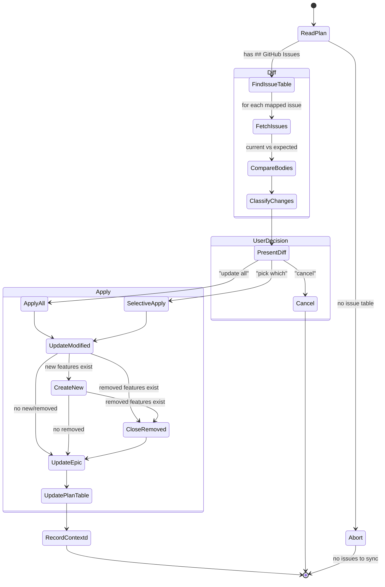

# Sync Issues

Push plan changes to existing GitHub Issues. Keeps issues in sync when the plan is updated after initial issue creation.



## When to Use

- User says "update issues", "sync issues", "push plan changes"
- Plan was modified after review (review loop updated sections)
- Plan was extended with new features (Extend Mode in generate-plans.md)
- Plan corrections were made during execution (Plan Correction Protocol)
- User manually edited the plan file

## Prerequisites

- Plan file exists with a `## GitHub Issues` table
- `gh` CLI authenticated
- Issues referenced in the table still exist and are open

---

## Process

### 1. Read the Plan

Read the plan file completely. Locate the `## GitHub Issues` table.

If no `## GitHub Issues` table exists:
- STOP. Tell the user: "This plan has no linked GitHub Issues. Want me to create them?" → redirect to [github-planning.md](github-planning.md)

### 2. Fetch Current Issue State

For each issue in the table:

```bash
gh issue view <number> --json number,title,body,state,labels
```

If an issue is closed or missing, flag it in the diff report.

### 3. Generate Expected Bodies

For each feature in the plan, regenerate the expected issue body using the current plan content and the appropriate asset template:

| Issue Type | Template |
|-----------|----------|
| SIMPLE (single issue) | [assets/issue-simple.md](../assets/issue-simple.md) |
| Epic | [assets/issue-epic.md](../assets/issue-epic.md) |
| Sub-issue | [assets/issue-sub-issue.md](../assets/issue-sub-issue.md) |

Fill in the template with the plan's **current** values for that feature (behavior, affected files, ACs, verification, DoD, source context).

For the Epic: regenerate the Full Implementation Plan `<details>` section from the entire current plan.

### 4. Classify Changes

Compare each issue's current body (from GitHub) against the expected body (from the plan). Classify into:

| Category | Signal | Action |
|----------|--------|--------|
| **UNCHANGED** | Bodies match (ignoring whitespace) | Skip |
| **MODIFIED** | Feature exists in both plan and table, body differs | Update issue body |
| **NEW** | Feature in plan has no row in the `## GitHub Issues` table | Create new sub-issue |
| **REMOVED** | Feature in table is marked `**Removed:**` in plan or no longer exists in plan | Close issue with comment |
| **CLOSED** | Issue is closed on GitHub but feature is active in plan | Flag — ask user |

### 5. Present Diff Summary

Show the user a summary before making any changes:

```
## Issue Sync: [Plan Name]

### Modified (will update body)
| Issue | Feature | Sections Changed |
|-------|---------|-----------------|
| #42 | Feature 1: User Registration | Behavior, AC-1.2 added, Affected Files |
| #43 | Feature 2: Login Endpoint | API Contract updated |

### New (will create sub-issue)
| Feature | Parent Epic |
|---------|-------------|
| Feature 4: Password Reset | #41 |

### Removed (will close with comment)
| Issue | Feature | Reason |
|-------|---------|--------|
| #44 | Feature 3: OAuth Login | Marked Removed in plan |

### Unchanged (no action)
- #41: [EPIC] Auth System (epic body will be updated if any sub-issues changed)

### Conflicts
- #45: Closed on GitHub but active in plan — reopen or remove from plan?
```

Use AskQuestion:
1. **Update all** — apply all changes
2. **Pick which** — let me choose which to apply
3. **Cancel** — don't change anything

### 6. Apply Changes

#### Update Modified Issues

For each MODIFIED issue:

```bash
# Regenerate body from plan using the template
cat > /tmp/issue-update-<number>.md << 'ISSUE_BODY'
# ... fill in template with current plan data ...
ISSUE_BODY

gh issue edit <number> --body-file /tmp/issue-update-<number>.md

rm /tmp/issue-update-<number>.md
```

Add a comment noting the sync:

```bash
gh issue comment <number> --body "Updated from plan: [sections changed]. Synced on YYYY-MM-DD."
```

#### Create New Sub-Issues

For each NEW feature, follow the sub-issue creation flow from [github-planning.md](github-planning.md) (GraphQL with `parentIssueId` or REST fallback). Use [assets/issue-sub-issue.md](../assets/issue-sub-issue.md).

#### Close Removed Issues

For each REMOVED feature:

```bash
gh issue close <number> --comment "Feature removed from plan on YYYY-MM-DD. Reason: <reason from plan's Removed annotation>"
```

#### Update the Epic

The Epic body contains the full plan in a `<details>` section. **Always regenerate it** when any sub-issue changed.

> **CRITICAL:** Read the plan file and inline its content into the body. Do NOT use `$(cat /path/to/plan.md)` — that exposes local filesystem paths in the GitHub Issue.

```bash
# INLINE the plan content — do not use $(cat ...) or file path references
cat > /tmp/epic-update.md << 'EPIC_BODY'
# ... regenerate assets/issue-epic.md with current plan data ...
# ... include updated Feature Dependency Graph ...
# ... include refreshed Full Implementation Plan <details> section ...
EPIC_BODY

gh issue edit <epic-number> --body-file /tmp/epic-update.md

rm /tmp/epic-update.md
```

Add a sync comment:

```bash
gh issue comment <epic-number> --body "Plan synced on YYYY-MM-DD. Changes: [summary of modified/new/removed features]."
```

### 7. Update the Plan File

Update the plan file with issue references in all locations:

**GitHub Issues table:**
- Add rows for newly created issues
- Update status for closed issues to `Closed (removed)`
- Keep existing rows for modified issues (status unchanged)

**Inline annotations** (for newly created issues during sync):
- Add `(#<number>)` to the new feature's entry in the Feature Dependency Graph
- Change the feature heading to `## Feature N: [Name] · #<number>`

**Remove annotations** (for closed issues):
- Remove `· #<number>` from the feature heading (or remove the feature section entirely if it was marked Removed)
- Remove `(#<number>)` from the Feature Dependency Graph entry

If using Extend Mode, add the new features to the changelog:

```markdown
## Changelog
- **YYYY-MM-DD**: Synced to GitHub Issues. Added Feature N (#<new-number>). Removed Feature M (#<closed-number>). Updated Features X, Y.
```

### 8. Record in contextd

```
mcp__contextd__memory_record(
  project_id: "<project>",
  title: "GitHub issue sync: <feature-name>",
  content: "Synced plan to issues. Modified: #<numbers>.
            Created: #<numbers>. Closed: #<numbers>.
            Epic: #<number> updated.",
  outcome: "success",
  tags: ["github-planning", "sync"]
)
```

---

## Selective Sync

When the user picks "Pick which", present each change individually:

For each change, use AskQuestion:
- **Apply** — update this issue
- **Skip** — leave this issue as-is
- **Edit** — let me modify the plan first, then re-diff

After selective sync, still update the Epic's Full Implementation Plan section to reflect whatever was applied.

---

## Handling Conflicts

### Issue closed on GitHub but feature active in plan

Ask the user:
1. **Reopen the issue** — `gh issue reopen <number>`, then update body
2. **Remove from plan** — mark the feature as `**Removed:**` in the plan
3. **Create new issue** — close the old one, create a fresh issue for the feature

### Issue edited on GitHub (out-of-band changes)

If the issue body was modified directly on GitHub (not through this skill), the diff will show the GitHub version as "current" and the plan version as "expected". Present both versions to the user:

1. **Overwrite with plan** — plan is the source of truth
2. **Keep GitHub version** — update the plan to match
3. **Merge manually** — show both, let user decide section by section

---

## Automatic Sync Detection

During the **Plan Review** stage, if the plan has a `## GitHub Issues` table and the review resulted in plan changes (NEEDS REVISION → updated):

After updating the plan, ask:
> "The plan was updated and has linked GitHub Issues. Want me to sync the changes to GitHub?"

During **Execute**, after Plan Correction Protocol fires (spec mismatch fix):

After updating the plan:
> "A plan correction was made. Want me to sync this change to issue #<number>?"

---

## Mandatory Checklist

- [ ] Plan file has `## GitHub Issues` table
- [ ] All issues fetched and state verified
- [ ] Expected bodies generated from current plan using correct asset templates
- [ ] Diff classified (MODIFIED, NEW, REMOVED, UNCHANGED, CLOSED)
- [ ] Diff summary presented to user before any changes
- [ ] User approved changes (all or selective)
- [ ] Modified issues updated via `gh issue edit --body-file`
- [ ] Sync comment added to every modified issue
- [ ] New sub-issues created with native parent link
- [ ] Removed issues closed with reason comment
- [ ] Epic body regenerated with current full plan
- [ ] `## GitHub Issues` table updated in plan file
- [ ] New feature headings annotated with `· #<number>` inline
- [ ] New features added to Dependency Graph with `(#<number>)`
- [ ] Removed features stripped of inline issue references
- [ ] Changelog entry added to plan file
- [ ] Recorded in contextd

---

## Red Flags

| Thought | Reality |
|---------|---------|
| "Just update the bodies, skip the diff" | User MUST see what's changing before you touch live issues. |
| "The epic doesn't need updating" | If ANY sub-issue changed, the epic's full plan section is stale. Update it. |
| "Skip the sync comment" | Comments create an audit trail. Always add them. |
| "I'll update the plan table later" | Plan and GitHub must stay in sync. Update the table now. |
| "Out-of-band edits don't matter" | Someone edited the issue for a reason. Surface the conflict. |
| "Just overwrite everything" | Selective sync exists for a reason. Ask the user. |
