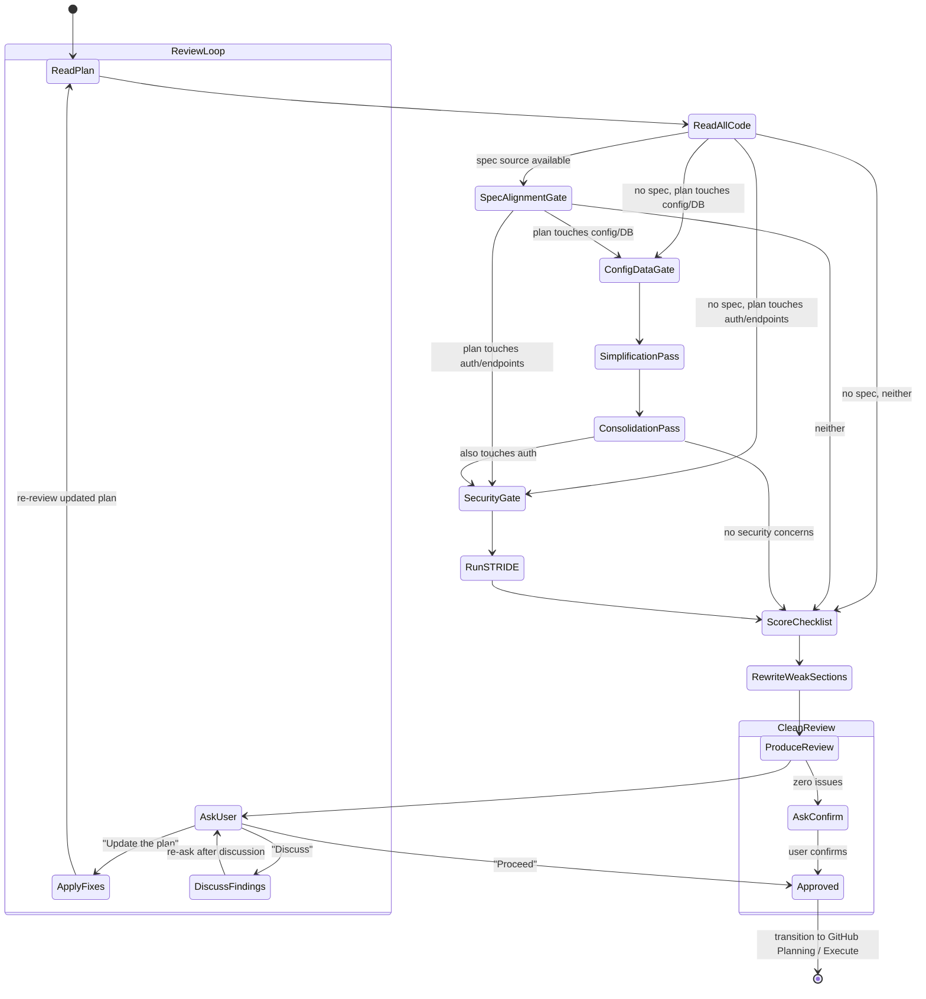

# Plan Review

Critically review implementation plans. Treat every plan as if submitted by a junior developer.

> **This is the Plan Review.** It evaluates implementation plans for quality, completeness, security, and adherence to project conventions. For reviewing technical specifications (finding inconsistencies, gaps, contradictions), see [spec-review.md](../../spec-review/references/spec-review.md).

**Announce at start** with message from [config.md](../../pmp/config.md) Stage Announcements.



## Master-Plan-Only Review

When reviewing a master plan generated without sub-plans (indicated by the "Reminder" block at the bottom):

- **Scope:** Review phase structure, dependency ordering, spec coverage completeness, and feature grouping — not detailed ACs or task tables (those don't exist yet)
- **Key checks:** All spec sections mapped to a phase, no circular phase dependencies, phase boundaries align with architectural concerns, entry/exit criteria are concrete
- **Skip:** Spec Fidelity, Testing Completeness, Parallelism & Task Structure, and Agent Readability checklist sections (these apply to sub-plans, not master plans)
- **Flag:** Any phase whose scope is too broad to implement in a single controller session (3-feature batch limit)

After review, remind the user: "Sub-plans will be generated during execution with `/pmp:execute`."

---

## The Review Mindset

You are a skeptical senior engineer. Do NOT:
- Trust assumptions — verify with code
- Accept vague descriptions — demand specifics
- Rubber-stamp anything — find what's wrong
- Be sycophantic — honest feedback over politeness

You MUST:
- Read ALL referenced code files completely
- Challenge design decisions
- Look for simpler alternatives
- Improve weak sections directly — return a better plan, not just feedback

## Re-Review Detection

Before starting the checklist, check the plan's YAML frontmatter for `reviewed_at`. If it has a value, this plan was previously reviewed — enter **re-review mode**:

1. **Load previous review** — look for a matching review file in `docs/reviews/` using the naming convention `YYYY-MM-DD-<plan-name>-review.md`
2. **Diff the plan** — compare the current plan against the version at the `reviewed_at` timestamp:
   ```bash
   # Find the commit closest to reviewed_at
   git log --before="<reviewed_at>" --format="%H" -1
   # Diff the plan file
   git diff <that-commit>..HEAD -- <plan-file-path>
   ```
3. **Classify changes:**
   - **New features** (added since last review) → full review (all checklist items)
   - **Modified features** (changed sections) → targeted review (only changed sections + their dependencies)
   - **Unchanged features** → skip (carry forward previous review verdict)
4. **Check finding resolution** — for each finding from the previous review:
   - Was the flagged section changed? → Re-evaluate and mark as "Resolved" or "Still present"
   - Was it unchanged? → Mark as "Unresolved" and carry forward
5. **Security gate always re-runs fully** — security analysis is never carried forward from a prior review
6. **Produce delta review** — use the same [review-output.md](../assets/review-output.md) template, but include the `### Previous Finding Resolution` section

### Saving Reviews for Re-Review

After producing any review (first or re-review), save the review output to `docs/reviews/` using a consistent name: `YYYY-MM-DD-<plan-name>-review.md`. This enables future re-reviews to find and diff against it.

---

## Review Checklist

Create a TodoWrite with these items and check each:

### Architecture & Design
- [ ] Approach aligns with existing patterns (check CLAUDE.md architecture)
- [ ] No unnecessary complexity — simpler alternatives considered
- [ ] Proper separation of concerns
- [ ] No circular dependency risks
- [ ] Changes fit the existing file layout

### Spec Alignment (when spec source available)
- [ ] Plan's `Source:` field points to a valid, readable spec file or directory
- [ ] Every spec requirement maps to at least one plan feature (no gaps)
- [ ] Every plan feature traces back to a spec requirement (no gold-plating)
- [ ] No plan feature contradicts a spec requirement
- [ ] Ambiguous spec areas are flagged explicitly (not silently interpreted)
- [ ] Feature "Affected Files" lists are complete for each spec requirement
- [ ] Acceptance criteria cover spec requirements (not just implementation details)

### Security
- [ ] Input validation addressed for every new input
- [ ] Auth boundaries properly defined
- [ ] Secret handling follows existing patterns (check CLAUDE.md for project conventions)
- [ ] Injection risks identified and mitigated
- [ ] Attack surface changes documented
- [ ] **Deep security analysis completed** — read [security-analysis.md](security-analysis.md) and run the full STRIDE + attack tree analysis for plans touching auth, data flows, new endpoints, logic, best practices or secrets

### Testing
- [ ] Every atomic change has tests
- [ ] Edge cases identified and covered
- [ ] TDD flow specified (red-green cycle)
- [ ] Integration tests in final phase only
- [ ] Verification commands include expected output
- [ ] **E2E testing check** — does the plan include end-to-end tests? If not, ask the user whether E2E tests should be added. Consider:
  - User-facing flows that cross multiple components or services
  - Critical paths (auth, payments, data pipelines) that break silently without E2E coverage
  - If the user opts to include E2E tests, add an E2E testing phase to the plan with specific scenarios, tooling, and pass/fail criteria
  - If the plan explicitly documents an E2E opt-out decision (per generate-plans.md § E2E Test Opt-Out), verify the opt-out reason is valid for the project type — do not flag as missing

### Config & Data Changes
- [ ] Config file changes identified (env vars, YAML, TOML, JSON configs)
- [ ] New config values have defaults or are documented as required
- [ ] **Config simplification review** — can any config keys be renamed to be more intuitive? Can related keys be grouped or merged to reduce cognitive load? Present options to the user:
  - Keys with cryptic/abbreviated names → suggest clearer names
  - Redundant or overlapping keys → suggest merging
  - Flat structures that would benefit from nesting (or vice versa)
  - Boolean flags that could be replaced by a single enum/mode selector
- [ ] Database schema changes identified (new tables, columns, indexes, constraints)
- [ ] **Table consolidation review** — can any new or existing tables be merged? Look for:
  - 1:1 relationships that should be a single table
  - Tables that share most columns and differ only by a "type" discriminator
  - Lookup/reference tables with very few rows that could be an enum or constant
  - Junction tables that carry no extra data and could be embedded as arrays/JSON
  - If consolidation is possible, present the user with options: (A) keep separate tables with justification, (B) merge with specific schema, (C) hybrid approach
- [ ] Migrations created for every schema change (up AND down/rollback)
- [ ] Migration ordering and dependencies are correct
- [ ] Existing data compatibility addressed (nullable columns, default values, backfills)
- [ ] Migration is idempotent or guarded against re-runs
- [ ] Rollback plan tested — down migration restores previous state without data loss

### Spec Fidelity
- [ ] Every feature has a Spec Source field linking to the exact spec section(s)
- [ ] Every AC quotes or paraphrases the spec requirement — not rewritten generically in the agent's own words
- [ ] Normative language preserved: spec's MUST stays MUST, SHOULD stays SHOULD — never downgraded
- [ ] Spec Traceability section exists and covers all spec sections
- [ ] No uncovered spec sections without explicit "intentional" justification
- [ ] No gold-plated features without spec source
- [ ] Error responses specify HTTP status, body schema, error code — not "returns an error"
- [ ] Thresholds reference named settings from the settings catalog — not "rejects large requests"
- [ ] State transitions specify from/to/trigger/side-effects — not "updates the status"

### Testing Completeness
- [ ] Every feature explicitly lists which testing layers apply (unit/module/integration/E2E) with rationale for each
- [ ] Module tests exist for self-contained components (auth, policy engine, config loader)
- [ ] Integration tests exist for features touching multiple components
- [ ] Performance test plan section exists when spec defines latency/throughput/concurrency targets
- [ ] Resilience test plan section exists when spec defines failure handling/retry/circuit breakers
- [ ] Fuzz test plan section exists when features include parsers or protocol decoders
- [ ] When test harness exists: ACs reference harness test IDs, not invented test cases
- [ ] All ACs structured as Red-Green-Refactor (RED: test fails → GREEN: minimal impl → REFACTOR: clean up)

### Parallelism & Task Structure
- [ ] Every task targets exactly one file (no multi-file tasks)
- [ ] Task dependency column populated for every task
- [ ] Task dependency graph (ASCII) present for every feature
- [ ] Feature dependency matrix present at plan level
- [ ] Independent features marked as parallelizable
- [ ] No circular dependencies in task or feature graphs

### Agent Readability
- [ ] Every step has exactly one interpretation — no "should", "might", "consider", "as needed" without defining what that means
- [ ] File paths are concrete and exact — no "relevant file", "the config", "appropriate location"
- [ ] Acceptance criteria are testable assertions — no "works correctly", "handles errors properly", "is performant"
- [ ] No implicit project knowledge assumed — no "the usual pattern", "standard approach", "as we do elsewhere" without showing the pattern inline
- [ ] Each feature has explicit scope boundaries (in AND out) — agent can't reasonably gold-plate or under-build
- [ ] Steps within each feature have a clear, unambiguous execution order
- [ ] When modifying existing code, the plan specifies what to change — agent doesn't have to read surrounding code and guess intent
- [ ] Error behavior is specified for every operation that can fail — which errors, what response, what log level
- [ ] No hand-waving: no "etc.", "and so on", "similar to above", "repeat for other cases"
- [ ] Code examples (when present) are complete and runnable — no pseudocode or partial snippets the agent must complete

### Completeness
- [ ] Phase exit criteria are specific and automated
- [ ] File paths are exact (not approximate)
- [ ] Out of scope section exists (prevents scope creep)
- [ ] No unresolved questions or TODOs

### Conventions
- [ ] Plans in correct directory (see [config.md](../../pmp/config.md) File Paths)
- [ ] Commit messages follow format (see [config.md](../../pmp/config.md) Commit Conventions)
- [ ] Detected CI command as verification gate
- [ ] Complexity within project-appropriate limits
- [ ] Branch from detected integration branch (never `main` unless it IS the integration branch)

## Review Process

1. **Read the plan completely**
2. **Read ALL referenced code files.** Use parallel agents only for the file reading itself when there are many files (10+) — each agent reads a partition of files and returns content. All subsequent analysis (checklist scoring, security gate, rewriting) runs in the main controller context using the already-loaded file contents. Do NOT spawn agents for analysis — they would re-read all files, wasting tokens.
3. **Spec alignment gate:** If the plan has a `Source:` field pointing to a local file or directory:
   - Read all spec files from the source location
   - Build a requirements-to-feature traceability matrix following [spec-alignment.md](spec-alignment.md)
   - Detect: unaddressed requirements, contradictions, silent ambiguity interpretations, incomplete "Affected Files" lists, gold-plating
   - Feed findings into the "Spec Alignment Analysis" and "Changes by File" sections of the review output
   - If `Source:` is missing, `"Inline spec"`, or non-local (GitHub URL, issue number): skip this gate and note `Spec alignment: skipped (no local spec source)` in the output
4. **Config & data gate:** If the plan adds/modifies config files or database schemas:
   - Verify migrations exist for every schema change, rollback is covered, and new config values have sensible defaults or are flagged as required
   - **Simplification pass:** Review all config keys touched by the plan — flag cryptic names, redundant keys, or structures that increase cognitive load. Propose clearer alternatives and present options to the user
   - **Consolidation pass:** Review all tables touched or created by the plan — identify 1:1 relationships, type-discriminated duplicates, or thin lookup tables that could merge. Present consolidation options to the user with trade-off analysis
5. **Security gate:** If the plan touches auth, data flows, new endpoints, or secrets — read [security-analysis.md](security-analysis.md) and run the full analysis. The security analysis runs in the main controller context, which already has all code files loaded from Step 2. Do not re-read files for the security gate — work from the file contents already in context. Append findings to the review output
6. **Score each checklist item** — pass, fail, or needs-work
7. **For each failure:** explain why and provide a specific fix
8. **Build the "Changes by File" view** — collect all issues from every section (spec alignment, architecture, security, testing, config, completeness) and group them by target file path. Each file entry lists: issue, severity, source section, and specific action needed. Include spec requirements and plan features that touch each file. This view enables parallel agent execution during plan updates.
9. **Rewrite weak sections** — don't just flag problems, fix them
10. **Produce the improved plan** or list of required changes

## Output Format

Use [assets/review-output.md](../assets/review-output.md) for the review report structure.

## After Review (Loop)

This stage loops. **Always use AskQuestion** before transitioning. Never auto-advance.

### When findings exist

Present the review, then ask the user:

Use AskQuestion with these options:
1. **Update the plan** — incorporate review findings into the plan
2. **Proceed to implementation** — move forward as-is
3. **Discuss** — talk through specific findings first

**If "Update the plan":**
1. Re-read the current plan file
2. Apply ALL review findings — critical, important, and minor — directly into the plan:
   - Rewrite flagged sections with the fixes from the review
   - Add missing items identified in the review
   - Incorporate accepted config simplification and table consolidation choices
   - Update migration steps if schema changes were revised
   - Update phase exit criteria to reflect any new requirements
3. Mark the plan with a `## Review Log` section at the bottom recording what changed and when
4. Present the updated plan to the user
5. **Re-run review** on the updated plan (loop back to the top of this stage)

**If "Discuss":**
- Address the user's questions
- After discussion, re-ask the same three options (stay in the loop)

**If "Proceed to implementation":**
- Continue to the transition step below

### When review is clean (APPROVED, zero issues)

Ask the user: "Plan looks good — no issues found. Ready to proceed to implementation?"
- Wait for confirmation before advancing

### Transition to Execute

Only after the user explicitly says to implement/execute:
1. **Update frontmatter:** Set `status: reviewed` and `reviewed_at` to the current UTC timestamp in the plan file (see [config.md](../../pmp/config.md) Plan Frontmatter)
2. Read [execute-loop.md](../../execute/references/execute-loop.md) and follow it
3. Do NOT start implementation without user confirmation
