# PMP — Plan

Full planning lifecycle: brainstorm, write, review, execute. Includes E2E dev loop for roadmap-driven, end-to-end tested implementation.

Use agent teams (Task tool) and track progress with TodoWrite throughout.

## Workflows

Five entry points. Workflows 1–4 share a path from Plan Review onward. Workflow 5 (Architecture & Spec Review) is standalone.

**CRITICAL: Always ask the user before transitioning to the next stage.** Use the AskQuestion tool. Never auto-advance. If any stage finds the plan needs modification, ask the user if we should update the plan (go back to Generate Plan).

### Main Lifecycle

```mermaid
stateDiagram-v2
    [*] --> Brainstorm : idea / feature request
    [*] --> GeneratePlan : spec / roadmap provided
    [*] --> FetchIssues : GitHub issues / epic provided
    [*] --> PlanReview : existing plan file
    [*] --> SpecReview : "review specs" / architecture review
    [*] --> GitHubPlanning : "create issues" / "make epic"
    [*] --> SyncIssues : "update issues" / "sync issues"
    [*] --> TestOnly : "run tests" / "re-test"

    state FetchIssues {
        [*] --> IdentifyEpic : issue URL / number
        IdentifyEpic --> FetchSubIssues : gh api graphql
        FetchSubIssues --> ParseIssueBodies
        ParseIssueBodies --> BuildRoadmap : normalize to feature specs
        BuildRoadmap --> PreFillIssueTable : issues already exist
        PreFillIssueTable --> [*]
    }

    FetchIssues --> GeneratePlan : issues fetched

    state Brainstorm {
        [*] --> Explore : read context
        Explore --> AskClarify
        AskClarify --> ProposeApproaches
        ProposeApproaches --> PresentDesign
        PresentDesign --> Refine
        Refine --> AskClarify : user wants changes
        Refine --> DesignDoc : user approves
        DesignDoc --> [*]
    }

    Brainstorm --> GeneratePlan : user confirms

    state GeneratePlan {
        [*] --> ReadRoadmap
        ReadRoadmap --> AnalyzeCodebase
        AnalyzeCodebase --> ClarifyRequirements
        ClarifyRequirements --> WritePlan
        WritePlan --> VerifyCoverage
        VerifyCoverage --> SavePlan
        SavePlan --> [*]
    }

    GeneratePlan --> PlanReview : user confirms

    state PlanReview {
        [*] --> ReadPlan
        ReadPlan --> ReadCode
        ReadCode --> SecurityGate
        SecurityGate --> ScoreChecklist
        ScoreChecklist --> ProduceReview

        ProduceReview --> UpdatePlan : user picks "update"
        ProduceReview --> Discuss : user picks "discuss"
        ProduceReview --> Approved : user picks "proceed"

        UpdatePlan --> ReadPlan : re-review
        Discuss --> ProduceReview : re-ask
        Approved --> [*]
    }

    PlanReview --> GitHubPlanning : user confirms
    PlanReview --> Execute : user declines issues

    state SpecReview {
        [*] --> MapCorpus
        MapCorpus --> ClassifyDocs
        ClassifyDocs --> ReadAllSpecs
        ReadAllSpecs --> ReconstructSystem
        ReconstructSystem --> DeepAnalysis
        DeepAnalysis --> ProduceReport

        ProduceReport --> DiscussFindings : user picks "discuss"
        ProduceReport --> ReviewDone : user picks "done"

        DiscussFindings --> ProduceReport : re-ask
        ReviewDone --> [*]
    }

    SpecReview --> [*] : report delivered

    state GitHubPlanning {
        [*] --> DetermineTier
        DetermineTier --> PreFlight
        PreFlight --> CreateLabels
        CreateLabels --> CreateIssues
        CreateIssues --> RecordMapping : write to plan file
        RecordMapping --> [*]
    }

    GitHubPlanning --> Execute : user confirms

    state Execute {
        [*] --> SetupInfra : first run
        SetupInfra --> FeatureLoop

        state FeatureLoop {
            [*] --> Implement
            Implement --> WriteE2E
            WriteE2E --> RunTests
            RunTests --> FixLoop : tests fail
            RunTests --> Commit : all pass
            FixLoop --> RunTests : fix applied
            FixLoop --> Blocked : ceiling reached
            Commit --> CommentOnIssue : if GH issues exist
            CommentOnIssue --> [*]
            Commit --> [*] : no GH issues
        }

        FeatureLoop --> FeatureLoop : next feature
        FeatureLoop --> FinalRun : all features done
        FinalRun --> CreatePR
        CreatePR --> PRClosesIssues : GH issues (Closes #N in body)
        PRClosesIssues --> UpdateFrontmatter
        CreatePR --> UpdateFrontmatter : no GH issues
        UpdateFrontmatter --> ArchivePlan : move to docs/plans/implemented/
        ArchivePlan --> [*]
    }

    state SyncIssues {
        [*] --> ReadPlanForSync
        ReadPlanForSync --> FetchCurrentIssues
        FetchCurrentIssues --> DiffBodies
        DiffBodies --> PresentDiff
        PresentDiff --> ApplySync : user approves
        ApplySync --> UpdateEpicBody
        UpdateEpicBody --> UpdatePlanTable
        UpdatePlanTable --> [*]
    }

    SyncIssues --> [*] : synced

    TestOnly --> [*] : results reported

    Execute --> [*] : done
```



### Workflow 1: From Scratch (idea, "what if", feature request)

1. Read [brainstorm.md](references/brainstorm.md) — loops until user says to move ahead, or agent asks and user confirms
2. **Ask:** "Ready to generate the implementation plan?" — wait for confirmation
3. Read [generate-plans.md](references/generate-plans.md) — produces the implementation plan
4. **Ask:** "Plan generated. Ready for plan review?" — wait for confirmation
5. Read [review.md](references/review.md) — **Plan Review**: loops until user says to implement/execute
6. **GitHub Planning** (see below) — publish plan as GitHub Issues if user opts in
7. Read [execute-loop.md](references/execute-loop.md) — implements with code-test-fix loop

### Workflow 2: From Spec/Roadmap (spec, requirements, roadmap provided)

1. Read [generate-plans.md](references/generate-plans.md) — produces the implementation plan from provided input
2. **Ask:** "Plan generated. Ready for plan review?" — wait for confirmation
3. Read [review.md](references/review.md) — **Plan Review**: loops until user says to implement/execute
4. **GitHub Planning** (see below) — publish plan as GitHub Issues if user opts in
5. Read [execute-loop.md](references/execute-loop.md) — implements with code-test-fix loop

### Workflow 3: From Existing Plan (plan file already exists)

1. Read [review.md](references/review.md) — **Plan Review**: loops until user says to implement/execute
2. **GitHub Planning** (see below) — publish plan as GitHub Issues if user opts in
3. Read [execute-loop.md](references/execute-loop.md) — implements with code-test-fix loop

### Workflow 4: From GitHub Issues (epic/issues already exist)

```
Fetch Issues → Generate Plan →ask→ Plan Review (loop) →ask→ Execute (PR closes issues)
```

1. Read [generate-plans.md](references/generate-plans.md) — **GitHub Issues Mode**: fetches epic + sub-issues, normalizes into roadmap, generates plan with `## GitHub Issues` table pre-populated
2. **Ask:** "Plan generated from GitHub Issues. Ready for plan review?" — wait for confirmation
3. Read [review.md](references/review.md) — **Plan Review**: loops until user says to implement/execute
4. **Skip GitHub Planning** — issues already exist, table is already in the plan
5. Read [execute-loop.md](references/execute-loop.md) — implements with code-test-fix loop, PR closes all issues on merge

### Workflow 5: Architecture & Spec Review (deep system analysis)

Standalone workflow — does not feed into Plan Review or Execute. Produces a read-only report.

```
Architecture & Spec Review (loop) → Done
```

1. Read [spec-review.md](references/spec-review.md) — reconstructs system model, runs 10-phase deep analysis (invariants, state machines, threat modeling, attack simulation, performance, resource utilization, failure modes, scalability, operability)
2. Loops on discussion until user says "done"

### Entry Point Detection

| Signal | Entry Point |
|--------|-------------|
| Idea, feature request, "what if", design discussion | **Workflow 1** — start at Brainstorm |
| Spec, requirements, roadmap, user stories provided | **Workflow 2** — start at Generate Plan |
| GitHub issue URL, epic number, "plan from issues", "plan from epic" | **Workflow 4** — start at Fetch Issues → Generate Plan |
| Existing plan file, "review this", "execute this" | **Workflow 3** — start at Plan Review |
| "review specs", "spec review", "architecture review", "design review", "threat model", "find inconsistencies", "review documentation", "check specs" | **Workflow 5** — start at Architecture & Spec Review |
| Existing plan + new roadmap items, "extend" | Read [generate-plans.md](references/generate-plans.md) (Extend Mode) then Plan Review |
| "create issues", "publish to GitHub", "make an epic" | **GitHub Planning Only** — read [github-planning](references/github-planning.md) with existing plan as input |
| "update issues", "sync issues", "push plan changes" | **Sync Issues** — read [sync-issues.md](references/sync-issues.md) to diff and update existing issues |
| "run tests", "re-test", "check E2E" | **Test Only** — see below |

YOU MUST read the reference file for the current stage before proceeding. The reference contains the full workflow.

## E2E Project Detection

Before **Generate Plan** or **Execute**, auto-detect and confirm with the user:

### 1. Project Type and E2E Testing Approach

| Project Type | Detection Signals | E2E Testing Approach |
|---|---|---|
| **Web App (frontend)** | `package.json` with React/Vue/Svelte/Next, HTML templates | Playwright test scripts or Playwright MCP browser tests |
| **Web App (fullstack)** | Both frontend + backend server | Playwright for UI + HTTP client for API |
| **REST/HTTP API** | Go/Python/Node server, no UI | Language-native HTTP test client |
| **CLI Tool** | `main.go`/`main.py` with cobra/argparse/click, no server | Subprocess execution + stdout/stderr/exit-code assertions |
| **Library/Package** | No main entrypoint, exported packages | Integration tests with realistic consumer scenarios |
| **gRPC/WebSocket** | Proto files, WS handlers | Protocol-specific test clients |

### 2. Project Conventions

| Convention | Detection Method | Fallback |
|---|---|---|
| **Integration branch** | `git branch -a` for `dev`/`develop`/`main`/`master`; check CLAUDE.md / CONTRIBUTING.md | Ask the user |
| **CI command** | `Makefile` targets (`ci`, `test`), `package.json` scripts, `.github/workflows/`, `Justfile` | Ask the user |
| **Test directory** | Existing `e2e/`, `tests/e2e/`, `test/`, `__tests__/`, `*_test.go` patterns | Propose based on project type |

Present ALL detections to the user for confirmation. User can override any.

### 3. Execution Model Selection

| Model | When | How |
|---|---|---|
| **Code-file tests** | Default for API, CLI, Library | Agent writes test code files, runs with single command, parses output. Persistent, CI-runnable. |
| **Agent-driven tests** | Option for Web Apps | Agent reads test spec markdown files, executes via Playwright MCP interactively. No test code files. |
| **Hybrid** | Fullstack projects | Code-file for API tests + chosen model for UI tests. Plan notes model per AC. |

Commit to one model during project detection. Confirm with the user before plan generation.

## Test Only Mode (E2E)

When the user just wants to re-run E2E tests (no new coding):

1. Read the plan's E2E Test Infrastructure section to find the test runner command (code-file) or test spec files (agent-driven)
2. Execute all E2E test suites
3. Report results in a summary table:

```
Suite           | Tests   | Status
────────────────┼─────────┼───────
Suite 1         | 5/5     | PASS
Suite 2         | 3/3     | PASS
────────────────┼─────────┼───────
Total           | 8/8     | ALL PASS
```

4. If failures found, offer to enter fix mode (Execute loop fix-loop)

For agent-driven tests, the user can specify which suites to run:
- No arguments: run all suites
- Suite names: run only those suites

## GitHub Planning Stage (Optional)

After Plan Review approves a plan and before Execute begins, offer to publish the plan as GitHub Issues.

### When It Triggers

After the Plan Review loop completes (APPROVED or user says "proceed"), use AskQuestion:

> "Plan is approved. Before implementation, want me to publish this plan as GitHub Issues?"

Options:
1. **Yes — create GitHub Issues** → proceed to GitHub planning
2. **No — go straight to implementation** → skip to Execute

If the user says yes, or if they explicitly requested GitHub issues at any point:

1. **Determine complexity tier** from the plan (see [config.md](config.md) Complexity Tiers)
2. **Read [github-planning.md](references/github-planning.md)** and follow it completely
3. **Source context:** For each Issue created, include the verbatim excerpt from the plan file (the feature spec, AC, or task description) that generated it in the Source Context section
4. **Annotate the plan file** — after all issues are created, embed issue references throughout the plan:
   - **Header:** Add `**Epic:** #<number>` to the plan header
   - **GitHub Issues table:** Add/update the `## GitHub Issues` section (see [assets/github-issues-table.md](assets/github-issues-table.md))
   - **Feature Dependency Graph:** Append `(#<number>)` to each feature entry
   - **Feature headings:** Change `## Feature N: [Name]` to `## Feature N: [Name] · #<number>`
   - This makes every section of the plan directly clickable to its corresponding issue
5. **Ask:** "Issues created and plan annotated. Ready to start implementation?" — wait for confirmation before Execute

### Issue Updates During Execution

When GitHub Issues exist for a plan (check for `## GitHub Issues` section in the plan file):

- **Per feature commit:** Comment on the issue linking the commit: `gh issue comment <number> --body "Implemented in <commit-sha>"` — do NOT close it
- **On PR creation:** Include `Closes #N` for every sub-issue AND the epic in the PR body — GitHub auto-closes all of them when the PR merges
- **Never manually close issues** — let the PR merge handle it. If the PR is rejected or reverted, issues stay open correctly

## Announcements

See [config.md](config.md) Stage Announcements.

## Plan File Locations

See [config.md](config.md) File Paths.

## Plan Frontmatter (MANDATORY)

Every plan file MUST have YAML frontmatter tracking its lifecycle status. See [config.md](config.md) Plan Frontmatter for the full schema.

**Status flow:** `draft` → `reviewed` → `issues_created` (if GitHub) → `executing` → `implemented`

Each workflow stage is responsible for updating the frontmatter before proceeding:
- **Generate Plan** sets `status: draft` + `created_at`
- **Plan Review** (on approval) sets `status: reviewed` + `reviewed_at`
- **GitHub Planning** sets `status: issues_created` + `issues_created_at` + `epic`
- **Execute** (on start) sets `status: executing` + `execution_started_at`
- **Execute** (on completion) sets `status: implemented` + `completed_at` + `pr`, then moves the plan to `docs/plans/implemented/`

If a stage is skipped (e.g., no GitHub Issues), the status jumps to the next applicable value.

## Project Rules (All Modes)

These are non-negotiable. No exceptions.

- **Plans location:** see [config.md](config.md) File Paths
- **Branching:** Branch from detected integration branch (see E2E Project Detection), PR back to it. NEVER commit to `main` unless it IS the integration branch
- **Security in every plan:** Input validation, auth boundaries, secret handling, injection risks, attack surface
- **Tests with every change:** Every atomic change includes tests. Coverage >= see [config.md](config.md) Thresholds
- **CI gate:** Detected CI command must pass clean before any commit (see E2E Project Detection)
- **Commits:** see [config.md](config.md) Commit Conventions
- **Complexity ceiling:** Enforce project-appropriate complexity limits (e.g., `gocyclo` for Go, ESLint complexity rule for JS/TS, Pylint for Python)
- **What, not how:** Plans describe behavior, inputs/outputs, constraints, affected files, rationale. The coding agent determines implementation
- **Parallel execution:** Use agent teams (Task tool) for 2+ independent subtasks — subject to the rules below
- **Context management:** Read [config.md](config.md) Context Management before Execute. Batch controllers every 3 features, demand structured returns from all subagents, use concise test output flags. Controller context exhaustion is the #1 cause of execution failures.

### Task Dependencies for Agent Teams

When creating tasks with `TaskCreate`, always set up dependency chains with `TaskUpdate` using `addBlocks`/`addBlockedBy` for tasks that have ordering requirements.

**Agents MUST follow this protocol:**
1. Before claiming a task, call `TaskGet` and verify `blockedBy` is empty or all blocking tasks are `completed`
2. Never start a blocked task — if all available tasks are blocked, notify the team lead and wait
3. After completing a task, call `TaskList` to check if any tasks were unblocked
4. When a task produces artifacts (files, configs, schemas) that downstream tasks depend on, include the artifact paths in the task description so dependent agents know what to read

**Team lead responsibilities:**
- Create ALL tasks with explicit dependency edges before spawning agents
- Stagger agent spawning: launch agents for unblocked tasks first, then spawn more as tasks complete
- When assigning tasks via `TaskUpdate`, double-check the task isn't blocked
- Include in each task's description: what it depends on, what files it reads/writes, and what it produces

### Parallel Agents (Task tool)

When using the Task tool to dispatch parallel agents:

1. **Only parallelize truly independent work** — if task B reads files that task A writes, they are NOT independent. Run A first, then B.
2. **Map file ownership before dispatching** — list which files each agent will read/write. If two agents write the same file, they MUST be serialized.
3. **Split into waves** — group independent tasks into waves. Launch wave N+1 only after wave N completes. Never launch dependent work speculatively.
4. **Lean prompts** — include only the file paths, task-specific decisions, and constraints each agent needs. Point to `CLAUDE.md` for project conventions instead of inlining them. Never dump the full plan into every agent prompt.
5. **Demand structured returns** — every agent MUST return in the structured format defined in [config.md](config.md) Context Management. Extract only the structured fields from agent returns — discard prose.
6. **Consolidate after parallel waves** — after a parallel wave completes, review all outputs for conflicts before launching the next wave.
7. **Use fast model for reviewers** — spec compliance and code quality reviewers are focused tasks that benefit from `model: fast`.

Never launch parallel agents that write to the same files or where one agent's output is another's input. When in doubt, serialize.

### E2E-Specific Principles

- **Specs, not code:** Plans describe WHAT to build/test, never HOW (no code snippets)
- **Structural traceability:** Every AC has its E2E test case directly beneath it — no cross-references needed
- **Deferred commits:** Do NOT commit until all E2E tests pass for a feature
- **Fix loop ceiling:** see [config.md](config.md) Thresholds for max attempts per feature
- **Test isolation:** Each feature's tests handle their own setup/teardown, runnable independently
- **No hardcoded conventions:** Integration branch, CI command, test directory all come from project detection

## Verification Gate

Before claiming ANY mode is complete:

1. **Identify** what command proves the claim
2. **Run** the command (fresh, complete)
3. **Read** full output, check exit code
4. **Verify** output confirms the claim
5. **Only then** make the claim

No shortcuts. Evidence before assertions. "Should work" is not evidence.

## Assets

Reusable templates for all artifacts. Reference files use these templates — read them when creating the corresponding artifact.

| Template | Purpose | Used By |
|----------|---------|---------|
| [plan.md](assets/plan.md) | Full implementation plan structure | generate-plans.md |
| [design-doc.md](assets/design-doc.md) | Design document from brainstorm | brainstorm.md |
| [feature.md](assets/feature.md) | Feature spec with ACs and E2E tests | generate-plans.md |
| [task.md](assets/task.md) | TDD task with steps | write.md |
| [review-output.md](assets/review-output.md) | Plan review verdict and findings | review.md |
| [spec-review-output.md](assets/spec-review-output.md) | Architecture & spec review report | spec-review.md |
| [issue-simple.md](assets/issue-simple.md) | SIMPLE tier: single issue body | github-planning.md |
| [issue-epic.md](assets/issue-epic.md) | STANDARD/COMPLEX tier: epic body | github-planning.md |
| [issue-sub-issue.md](assets/issue-sub-issue.md) | Sub-issue body | github-planning.md |
| [pr-body.md](assets/pr-body.md) | Pull request body | execute-loop.md |
| [e2e-test-spec.md](assets/e2e-test-spec.md) | Agent-driven test spec format | execute-loop.md |
| [security-analysis-output.md](assets/security-analysis-output.md) | Security analysis report | security-analysis.md |
| [github-issues-table.md](assets/github-issues-table.md) | Feature→Issue mapping table | generate-plans.md, github-planning.md |
| [phase-exit-criteria.md](assets/phase-exit-criteria.md) | Phase gate checklist | write.md |
| [yaml-feature-form.yml](assets/yaml-feature-form.yml) | GitHub Issue form: feature | github-planning.md |
| [yaml-bug-form.yml](assets/yaml-bug-form.yml) | GitHub Issue form: bug | github-planning.md |
| [yaml-epic-form.yml](assets/yaml-epic-form.yml) | GitHub Issue form: epic | github-planning.md |

## Configuration

All constants (paths, thresholds, labels, announcements, commit conventions, **context management**) live in [config.md](config.md). Read it before any stage to get current values. The Context Management section is especially critical before Execute — it defines batch sizes, structured return formats, and controller hygiene rules that prevent context exhaustion.

## Additional Resources

- Plan generation: [generate-plans.md](references/generate-plans.md)
- Plan review: [review.md](references/review.md)
- Architecture & spec review: [spec-review.md](references/spec-review.md)
- Code-test-fix execution loop: [execute-loop.md](references/execute-loop.md)
- Per-project-type E2E framework guidance: [testing-approaches.md](references/testing-approaches.md)
- Security analysis (used during Plan Review): [security-analysis.md](references/security-analysis.md)
- GitHub Issues/Projects from plans: [github-planning.md](references/github-planning.md)
- Sync plan changes to existing issues: [sync-issues.md](references/sync-issues.md)
