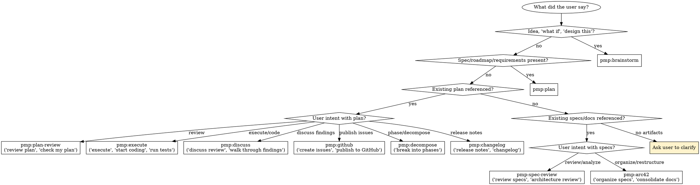

# PMP — Plan

**Announce at start:** "Using PMP to route this planning request."

Full planning lifecycle: brainstorm, write, review, execute. Routes to focused sub-skills for each stage.

Use agent teams (Task tool) and track progress with TodoWrite throughout.

## The Iron Law

```
NO STAGE TRANSITIONS WITHOUT EXPLICIT USER CONFIRMATION
```

**Violating the letter of this rule is violating the spirit of this rule.**

Use the AskQuestion tool. Never auto-advance.

| Excuse | Reality |
|--------|---------|
| "The design is approved, moving to plan" | User must explicitly say to proceed |
| "Plan review passed, starting execution" | Ask first. Always. |
| "It's obvious they want to continue" | Obvious ≠ confirmed |
| "I'll save them time by auto-advancing" | You'll waste their time by doing wrong work |
| "They said 'go ahead' earlier" | 'Go ahead' for step N ≠ permission for step N+1 |

## Red Flags — STOP

- About to invoke a sub-skill without asking the user first
- Assuming user wants the "next" stage because the current one finished
- Routing to a stage based on what seems logical rather than what user said
- Using "should", "probably" about which stage the user wants

## Sub-Skills

For direct invocation when you know which stage you need:

| Sub-Skill | When to Use |
|-----------|-------------|
| `/pmp:brainstorm` | Explore ideas, design approaches, produce design doc |
| `/pmp:plan` | Generate implementation plan from spec, roadmap, or GitHub Issues |
| `/pmp:plan-review` | Skeptical senior-engineer review of an existing plan |
| `/pmp:execute` | Code-test-fix loop, implements plan with agent teams. Also: test-only mode |
| `/pmp:spec-review` | Full architecture & spec analysis — orchestrates all sub-reviews (standalone) |
| `/pmp:spec-architecture` | Architecture quality: simplicity, consistency, invariants, state machines |
| `/pmp:spec-security` | Security: STRIDE threat modeling, attack simulation, AI red team |
| `/pmp:spec-operations` | Operations: performance, resources, failure modes, scalability, operability |
| `/pmp:spec-implementability` | Implementability: 13-criteria production-readiness gate (includes agent compliance) |
| `/pmp:discuss` | Structured walkthrough of review findings, collect fixes into a plan |
| `/pmp:github` | Publish plan as GitHub Issues/Projects, or sync changes to existing issues |
| `/pmp:decompose` | Break large plans into dependency-ordered phases |
| `/pmp:changelog` | Generate user-facing release notes from completed plans |
| `/pmp:arc42` | Reorganize spec files into arc42 standard structure |
| `/pmp:test-harness` | Generate structured JSON/Markdown test specifications from system specs |
| `/pmp:spec-index` | Generate SSoT ownership registry from spec files |

## Routing



When the user's intent maps to a specific stage, read the reference for that stage directly:

| Signal | Stage | Reference |
|--------|-------|-----------|
| Idea, feature request, "what if", "design this" | Brainstorm | [brainstorm.md](../brainstorm/references/brainstorm.md) |
| Spec, roadmap, requirements, "create a plan" | Plan | [generate-plans.md](../plan/references/generate-plans.md) |
| GitHub issue URL, epic number, "plan from issues" | Plan (Issues Mode) | [generate-plans.md](../plan/references/generate-plans.md) |
| Existing plan file, "review this" | Review | [review.md](../plan-review/references/review.md) |
| "execute plan", "implement", "start coding" | Execute | [execute-loop.md](../execute/references/execute-loop.md) |
| "review specs", "architecture review", "full spec review" | Spec Review (full) | [spec-review.md](../spec-review/references/spec-review.md) |
| "review architecture", "simplicity", "consistency check" | Spec Architecture | [spec-architecture.md](../spec-architecture/references/spec-architecture.md) |
| "threat model", "security review", "red team" | Spec Security | [spec-security.md](../spec-security/references/spec-security.md) |
| "operations review", "performance review", "scalability" | Spec Operations | [spec-operations.md](../spec-operations/references/spec-operations.md) |
| "implementability", "ready to code", "spec completeness" | Spec Implementability | [spec-implementability.md](../spec-implementability/references/spec-implementability.md) |
| "create issues", "make an epic" | GitHub | [github-planning.md](../github/references/github-planning.md) |
| "sync issues", "update issues" | GitHub (Sync) | [sync-issues.md](../github/references/sync-issues.md) |
| "discuss review", "walk through findings", "go through the review" | Discuss | [discuss.md](../discuss/references/discuss.md) |
| "decompose plan", "break into phases", "phase this plan" | Decompose | [decompose.md](../decompose/references/decompose.md) |
| "generate release notes", "changelog", "what was built" | Changelog | [changelog.md](../changelog/references/changelog.md) |
| "organize specs", "arc42", "consolidate docs", "clean up specs", "reorganize architecture", "merge spec files" | Arc42 | [arc42.md](../arc42/references/arc42.md) |
| "generate test harness", "test spec", "testing specification", "test plan" | Test Harness | [testing-harness-prompt.md](../test-harness/references/testing-harness-prompt.md) |
| "generate spec index", "build spec index", "update spec index", "spec index", "ssot index" | Spec Index | [spec-index-generator.md](../spec-index/references/spec-index-generator.md) |
| "run tests", "re-test" | Execute (Test Only) | [execute-loop.md](../execute/references/execute-loop.md) |
| Existing plan + "extend" | Plan (Extend) | [generate-plans.md](../plan/references/generate-plans.md) |

### Lifecycle Flow

Workflows 1–4 share a path: each stage hands off to the next with user confirmation.

1. **Brainstorm** → asks "Ready to generate the plan?" → **Plan**
2. **Plan** → asks "Ready for plan review?" → **Review**
3. **Review** → asks "Publish as GitHub Issues?" → **GitHub** (optional) → **Execute**
4. **Execute** → implements, creates PR, archives plan → optionally **Changelog**

Workflow 5 (**Spec Review**) is standalone — produces a report, no execution.

**Arc42** is standalone — reorganizes spec files into arc42 structure, no execution.

**Discuss** can follow either Review or Spec Review — walks through findings interactively, collects fixes into a plan, then optionally hands off to Execute.

**Decompose** can be invoked on any existing plan with 5+ features to add phase boundaries. Also auto-triggers during plan generation.

**Changelog** can follow Execute or be invoked standalone on any completed plan.

## Project Rules

Non-negotiable across all modes:

- **Branching:** Branch from detected integration branch, PR back to it. NEVER commit to `main` unless it IS the integration branch
- **Security in every plan:** Input validation, auth boundaries, secret handling, injection risks, attack surface
- **Tests with every change:** Implementation commits include unit/integration tests. E2E tests in separate commit per feature
- **CI gate:** Detected CI command must pass clean before any commit
- **What, not how:** Plans describe behavior, not implementation — the coding agent determines how
- **Context management:** Read [config.md](config.md) before Execute. Batch controllers every 3 features, demand structured returns. Context exhaustion is the #1 cause of execution failures.
- **Verification gate:** Before claiming any mode is complete — run the command, read output, verify. Evidence before assertions.

## Configuration & References

All constants (paths, thresholds, labels, commits, context management) live in [config.md](config.md). Read it before any stage.

For spec file formatting and linking rules (one file per concept, summary blocks, cross-references, naming, deduplication): [single-source-of-truth.md](references/single-source-of-truth.md).

For lifecycle diagrams, file tree, assets table, and changelog: [overview.md](references/overview.md).
