# Execute Loop

Implements features from the plan and verifies each with its E2E tests in an automated code-test-fix loop.

```mermaid
stateDiagram-v2
    [*] --> Setup

    state Setup {
        [*] --> ReadPlan
        ReadPlan --> CheckoutBranch
        CheckoutBranch --> CheckGHIssues
        CheckGHIssues --> SetupInfra
        SetupInfra --> VerifyRunner
        VerifyRunner --> InfraFailed : runner fails
        VerifyRunner --> Ready : runner works
        InfraFailed --> [*] : STOP — ask user
        Ready --> [*]
    }

    Setup --> FeatureN : for each feature in dependency order

    state FeatureN {
        [*] --> Implement
        Implement --> WriteE2E
        WriteE2E --> RunAllTests

        RunAllTests --> FixLoop : any test fails
        RunAllTests --> Commit : all pass

        state FixLoop {
            [*] --> ParseFailure
            ParseFailure --> Classify

            Classify --> FixImpl : DETERMINISTIC BUG
            Classify --> FixTest : FLAKY
            Classify --> FixBoth : SPEC MISMATCH
            Classify --> RestartInfra : INFRASTRUCTURE

            FixImpl --> Rerun
            FixTest --> Rerun
            FixBoth --> Rerun
            RestartInfra --> Rerun

            Rerun --> IncrementCounter
            IncrementCounter --> [*] : tests pass
            IncrementCounter --> ParseFailure : tests fail, < ceiling
            IncrementCounter --> Blocked : ceiling reached
        }

        FixLoop --> Commit : tests pass
        FixLoop --> AskUser : blocked

        Commit --> RunCI
        RunCI --> CommentOnIssue : CI pass + issues exist
        RunCI --> FeatureDone : CI pass, no issues
        RunCI --> FixCI : CI fail
        FixCI --> RunCI
        CommentOnIssue --> FeatureDone
        FeatureDone --> [*]
    }

    FeatureN --> FeatureN : next feature
    FeatureN --> Completion : all features done

    state Completion {
        [*] --> FinalE2ERun
        FinalE2ERun --> FinalCI
        FinalCI --> PrintResults
        PrintResults --> AskPR
        AskPR --> CreatePR : user says yes
        AskPR --> UpdateFrontmatter : user says no
        CreatePR --> PRClosesIssues : GH issues exist (Closes #N in body)
        CreatePR --> UpdateFrontmatter : no GH issues
        PRClosesIssues --> UpdateFrontmatter
        UpdateFrontmatter --> ArchivePlan : move to docs/plans/implemented/
        ArchivePlan --> [*]
    }

    Completion --> [*] : done
```



## Context Management

Read [config.md](../config.md) Context Management before starting. The rules below are critical for preventing context window exhaustion during execution.

### Batch Controllers

Do NOT execute the entire plan in a single controller session. Split features into batches of **3** (see config.md Max features per controller session).

**Per-batch workflow:**
1. Controller reads the plan once and identifies the next batch of features
2. Controller dispatches subagents for each feature in the batch (sequentially — features have dependencies)
3. After the batch completes, controller writes a **checkpoint summary**:
   ```
   BATCH: [N] of [total]
   COMPLETED: Feature 1 (commit abc), Feature 2 (commit def), Feature 3 (commit ghi)
   BRANCH: feat/<name> at commit ghi
   REMAINING: Feature 4, Feature 5, ...
   ISSUES: none | [brief list]
   ```
4. A fresh controller session picks up from the checkpoint to execute the next batch
5. The fresh controller reads only: the plan file, the checkpoint summary, and the current branch state — NOT the full history of previous batches

### Concise Test Output

Always use concise output flags for test runners. Verbose test output is the #1 context consumer in fix loops.

| Runner | Concise Flag | Example |
|--------|-------------|---------|
| pytest | `--tb=short -q` | `pytest --tb=short -q` |
| Jest | `--silent --verbose=false` | `npx jest --silent` |
| Go test | pipe through `tail -50` | `go test ./... 2>&1 \| tail -50` |
| Playwright | `--reporter=dot` | `npx playwright test --reporter=dot` |
| Vitest | `--reporter=dot` | `npx vitest --reporter=dot` |

On failure, read only the **last 50 lines** of output to identify the failing test and error message. Do NOT capture the full multi-page output into context.

### Subagent Returns

All subagents MUST use the structured return format defined in [config.md](../config.md) Context Management. The controller should extract only the structured fields and discard verbose prose.

### Fix Loop Context

Each fix loop iteration consumes context. When dispatching a fix agent (or resuming an implementer to fix issues):
- Provide ONLY: the failing test name, the error message (1-3 lines), and the classification
- Do NOT include: full test output, previous fix attempts, or the full task description again
- The agent already has the code — it only needs to know what broke

---

## Before Starting

1. **Read the plan completely**
2. **Update frontmatter:** Set `status: executing` and `execution_started_at` to the current UTC timestamp in the plan file (see [config.md](../config.md) Plan Frontmatter)
3. **Read integration branch** from the plan header:
   ```
   git checkout <branch> && git pull && git checkout -b feat/<name>
   ```
4. **Read CI command** from the plan header
5. **Check for GitHub Issues:** Look for a `## GitHub Issues` section in the plan. If present, note the feature→issue mapping — you'll comment on issues as features are committed and include `Closes #N` in the PR body
6. **Create TodoWrite** with all features from the plan
7. **Determine batch boundaries** — split features into batches of 3 (see Context Management above). Only execute the first batch in this session.
8. **Set up E2E test infrastructure** (ALWAYS the first task):
   - Follow the plan's "E2E Test Infrastructure" section
   - Install framework, configure test runner, set up environment
9. **Verify the test runner works**:
   - Run the test runner command with concise output flags (see Context Management above) -- should exit cleanly even with no tests
   - For agent-driven model: verify Playwright MCP is available and browser launches
10. **If infrastructure setup fails**: STOP immediately. Report the failure with full error output. Do NOT proceed to feature implementation. E2E tests are the verification backbone -- coding without them defeats the purpose of this skill.

## Agent Coordination Protocol

When executing features with agent teams (Task tool), follow these rules strictly.

### Task Dependencies

When creating tasks with `TaskCreate`, always set up dependency chains with `TaskUpdate` using `addBlocks`/`addBlockedBy` for tasks that have ordering requirements.

**Agents MUST follow this protocol:**
1. Before claiming a task, call `TaskGet` and verify `blockedBy` is empty or all blocking tasks are `completed`
2. Never start a blocked task — if all available tasks are blocked, notify the team lead and wait
3. After completing a task, call `TaskList` to check if any tasks were unblocked
4. When a task produces artifacts (files, configs, schemas) that downstream tasks depend on, include the artifact paths in the task description so dependent agents know what to read

**Team lead responsibilities:**
- Create ALL tasks with explicit dependency edges before spawning agents
- Stagger agent spawning: launch agents for unblocked tasks first, then spawn more as tasks complete
- When assigning tasks via `TaskUpdate`, double-check the task isn't blocked
- Include in each task's description: what it depends on, what files it reads/writes, and what it produces

### Parallel Agent Dispatching

1. **Only parallelize truly independent work** — if task B reads files that task A writes, they are NOT independent. Run A first, then B.
2. **Map file ownership before dispatching** — list which files each agent will read/write. If two agents write the same file, they MUST be serialized.
3. **Split into waves** — group independent tasks into waves. Launch wave N+1 only after wave N completes. Never launch dependent work speculatively.
4. **Include full context in each agent's prompt** — parallel agents share nothing. Each prompt must contain all file paths, decisions, and constraints it needs. Never assume an agent can see another agent's output.
5. **Consolidate after parallel waves** — after a parallel wave completes, review all outputs for conflicts before launching the next wave.

Never launch parallel agents that write to the same files or where one agent's output is another's input. When in doubt, serialize.

### Practical Wins

1. **Explicit file ownership in task descriptions** — "This task writes `streaming.go`, no other task should modify it" prevents overwrite conflicts
2. **Staggered spawning** — don't launch 5 agents if only 2 tasks are unblocked
3. **Artifact paths in descriptions** — telling an agent "read the schema from `internal/db/schema.go` (produced by task 1)" is more reliable than hoping it checks

---

## Unit TDD Within Features

This loop does NOT replace unit-level TDD. Within step 1 (IMPLEMENT) of each feature, if the project uses TDD (check for existing test patterns, TDD skill, or project docs), follow Red-Green-Refactor for unit tests. The E2E test in step 2 is an additional integration verification layer, not a replacement for unit tests.

---

## Per-Feature Loop (Code-File Model)

For each feature in dependency order:

### Step 1: IMPLEMENT

- Read the feature spec from the plan
- Implement the feature (apply unit TDD if project uses it)
- Run existing unit tests to verify no regressions
- Do NOT commit yet

### Step 2: WRITE E2E TEST

- Read the E2E test cases under the current feature's acceptance criteria
- Write the E2E test file to the test directory following the specs exactly
- Do NOT commit yet

### Step 3: RUN ALL E2E TESTS

- Execute the test runner command with concise output flags (runs ALL suites, not just the new one)
- On success: note pass count only (do NOT capture full output into context)
- On failure: read only the last 50 lines to identify failing test and error

### Step 4: FIX LOOP

**Hard ceiling: see [config.md](../config.md) Thresholds for fix loop ceiling.**

If any test fails:

**a. Parse the failure** -- which test, what assertion, actual vs expected

**b. Classify the failure:**

| Category | Signal | Action |
|---|---|---|
| **DETERMINISTIC BUG** | Same test fails the same way every run | Fix the implementation code |
| **FLAKY** | Test passes on immediate retry | Add retry/wait logic to the test |
| **SPEC MISMATCH** | Test expectation is wrong (e.g., expected 200 but 201 is correct) | Fix test code AND update the plan (see Plan Correction below) |
| **INFRASTRUCTURE** | Server crashed, DB down, port conflict | Restart infrastructure and re-run |

**c. Apply the fix**

**d. Re-run ALL E2E tests**

**e. Increment the feature attempt counter** (regardless of which category)

**f. If ceiling reached (see [config.md](../config.md) Thresholds):** STOP. Report concisely:
- Which test(s) are failing (name + 1-line error)
- Failure classification per attempt (1 line each)
- What was tried (1 line per attempt)

Ask the user for help before proceeding.

### Step 5: COMMIT

Only after ALL E2E tests pass:

- Stage implementation code + E2E test file together
- Commit using format from [config.md](../config.md) Commit Conventions
- Run the project CI command (from plan header)
- If CI fails, fix and amend the commit
- **Comment on GitHub Issue** (if issues exist for this plan) using format from [config.md](../config.md) GitHub Conventions — do NOT close; the PR will close it on merge
- Mark feature complete in TodoWrite

### Step 6: NEXT FEATURE OR BATCH HANDOFF

If more features remain in the current batch: go to Step 1 for the next feature.

If the current batch is complete but more features remain in the plan:
1. Write a checkpoint summary (see Context Management above)
2. Report to the user: "Batch N complete. N features remaining. Start a fresh session to continue."
3. The fresh controller session reads: plan file + checkpoint summary + branch state

If all features are done: proceed to Completion.

---

## Per-Feature Loop (Agent-Driven Model)

For web apps using Playwright MCP instead of code-file tests.

### Step 1: IMPLEMENT

Same as code-file model: implement feature, apply unit TDD if applicable. Do NOT commit yet.

### Step 2: WRITE TEST SPEC

- Read the E2E test cases under the current feature's acceptance criteria
- Write the test spec file to the PROJECT's test directory: `<test-dir>/<feature>-tests.md`
  (e.g., `e2e/providers-tests.md` -- inside the project, NOT inside the skill directory)
- Do NOT commit yet

### Step 3: EXECUTE TESTS VIA PLAYWRIGHT MCP

Agent-driven tests are expensive (each action = MCP call + snapshot). Use a tiered strategy:

**a. Run the NEW suite in full:** Execute all test cases for the current feature. For each test case:
- Follow the steps in the spec exactly
- After every browser action (click, fill, navigate), take a snapshot
- Verify assertions against the snapshot
- Record PASS/FAIL per test case

**b. Run SMOKE CHECK of previous suites:** Execute only the FIRST test case of each prior suite to verify no regressions. Full re-run of all prior suites is too expensive per feature.

**c. Record results** for all executed test cases.

### Step 4: FIX LOOP

Same hard ceiling (see [config.md](../config.md) Thresholds) and classification as code-file model, with adjustments:

- **FLAKY**: Add explicit `browser_wait_for` calls before assertions in the test spec
- **SPEC MISMATCH**: Update both the test spec file and the plan
- **Re-runs**: Only re-execute the failing suite(s), not the full smoke check again

### Step 5: COMMIT

Only after the new suite passes AND the smoke check passes:

- Stage implementation code + test spec files together
- Commit using format from [config.md](../config.md) Commit Conventions
- Run project CI command if applicable
- **Comment on GitHub Issue** (if issues exist for this plan) using format from [config.md](../config.md) GitHub Conventions — do NOT close; the PR will close it on merge
- Mark feature complete in TodoWrite

### Step 6: NEXT FEATURE OR BATCH HANDOFF

Same as code-file model Step 6: continue within batch, or write checkpoint and hand off to fresh session.

---

## Hybrid Model (Fullstack)

When the plan uses hybrid execution (code-file for API, agent-driven for UI):

- Each feature may have API tests and/or UI tests (noted per AC in the plan)
- In Step 2: write code-file tests for API suites, write spec files for UI suites
- In Step 3: run code-file test runner for API suites, then execute agent-driven specs for UI suites
- In Step 4: apply fixes and re-run only the failing model's tests
- In Step 5: commit all (implementation + test files + test specs) together

---

## Plan Correction Protocol

When the agent discovers a spec mismatch (the plan is wrong about expected behavior):

1. **Fix the test code/spec** to match actual correct behavior
2. **Add a correction note** to the affected E2E test case in the plan file:
   ```markdown
   **Correction (YYYY-MM-DD):** Changed expected status from 200 to 201.
   Reason: POST endpoint correctly returns 201 Created per REST conventions.
   ```
3. Do NOT silently deviate -- every plan correction must be visible in the plan file

---

## Completion

After all features are implemented and pass:

1. **Run full E2E test suite one final time** -- ALL suites, ALL test cases
   - For agent-driven: this is the full regression run (only time all suites run completely)
   - For code-file: same as any other run (test runner runs everything)
2. **Run project CI command** (from plan header)
3. **Print final results table:**

```
Feature         | E2E Tests | Status
────────────────┼───────────┼───────
Feature 1       | 5/5       | PASS
Feature 2       | 3/3       | PASS
Feature 3       | 4/4       | PASS
────────────────┼───────────┼───────
Total           | 12/12     | ALL PASS
```

4. **Ask the user:** "All features pass and CI is clean. Want me to create a PR?"
5. **If yes — build PR body with closing keywords** (if GitHub Issues exist for this plan):
   - Read the `## GitHub Issues` table from the plan file
   - Collect ALL issue numbers (sub-issues AND epic)
   - Create the PR with `Closes #N` for every issue:
   ```bash
   gh pr create --title "feat: <feature-set-name>" --body "$(cat <<'EOF'
   ## Summary
   <summary of all implemented features>

   ## Closes
   Closes #<sub-issue-1>
   Closes #<sub-issue-2>
   Closes #<sub-issue-N>
   Closes #<epic>

   ## E2E Test Results
   | Feature | Tests | Status |
   |---------|-------|--------|
   | Feature 1 | 5/5 | PASS |
   | Feature 2 | 3/3 | PASS |
   | Total | 8/8 | ALL PASS |
   EOF
   )"
   ```
   - Update the `## GitHub Issues` table in the plan file — set all statuses to `Closes via PR #<number>`
   - **Do NOT** manually run `gh issue close` — GitHub auto-closes all listed issues when the PR merges
6. **If yes — no GitHub Issues:** Create PR normally with `gh pr create` summarizing features and E2E results
7. **Update frontmatter (MANDATORY):** Update the plan file's YAML frontmatter (see [config.md](../config.md) Plan Frontmatter):
   - Set `status: implemented`
   - Set `completed_at` to the current UTC timestamp
   - Set `pr: "#<number>"` (the PR number just created, or blank if user declined PR)
   - Preserve all other frontmatter fields from prior stages
8. **Archive the plan:** Move the plan file from plans directory to completed plans directory `docs/plans/implemented/` (see [config.md](../config.md) File Paths; create directory if it doesn't exist):
   ```bash
   mkdir -p docs/plans/implemented
   mv docs/plans/<plan-file>.md docs/plans/implemented/<plan-file>.md
   ```
9. **Announce** with completion message from [config.md](../config.md) Stage Announcements

---

## When to Stop and Ask

STOP immediately and ask the user when:

- Deterministic E2E test failure persists after fix loop ceiling (see [config.md](../config.md) Thresholds)
- New feature breaks a previously-passing E2E suite and the regression fix is non-obvious
- Missing infrastructure (DB, service, API key) that can't be mocked or substituted
- Ambiguous requirement that affects test correctness and can't be resolved from the plan
- Flaky test persists after adding retries/waits (may indicate a real race condition)

In all cases: report what's broken with full context (failure output, classification, attempted fixes), then ask the user.
