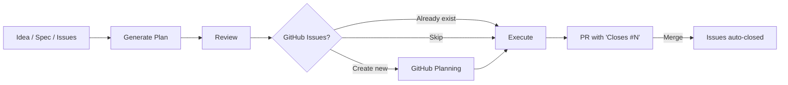

# PMP + GitHub Planning

An AI-agent-driven planning and execution system. Goes from idea to merged PR with full E2E test coverage and GitHub Issue tracking.

## How It Works

### The Lifecycle



Every transition between stages requires user confirmation. The agent never auto-advances.

### Four Entry Points

| You say... | What happens |
|------------|--------------|
| "I have an idea for..." | **Workflow 1** -- Brainstorm → Plan → Review → Execute |
| "Here's my roadmap/spec" | **Workflow 2** -- Plan → Review → Execute |
| "Plan from epic #41" | **Workflow 4** -- Fetch Issues → Plan → Review → Execute |
| "Review this plan" | **Workflow 3** -- Review → Execute |

Plus standalone modes:

| You say... | What happens |
|------------|--------------|
| "Create issues for this plan" | GitHub Planning only (plan already exists) |
| "Update issues" / "Sync issues" | Sync Issues — diff plan against live issues, push changes |
| "Run E2E tests" | Test Only mode (no implementation) |

## The GitHub Integration

### Direction 1: Plan → Issues

After the agent generates and reviews a plan, it offers to publish it as GitHub Issues.

```
Plan approved
  → Agent determines complexity tier:
      SIMPLE (1-3 tasks)  → Single issue with checklist
      STANDARD (4-10)     → Epic + native sub-issues + milestone
      COMPLEX (10+)       → Epic + sub-issues + Projects v2 board
  → Creates issues with labels, verification criteria, and source context
  → Writes issue mapping table into the plan file
```

### Direction 2: Issues → Plan

A PM creates the epic and sub-issues in GitHub (manually or via the github-planning reference). Then tells the agent to plan from them.

```
PM creates Epic #41 with sub-issues #42, #43, #44
  → Agent fetches via `gh api graphql`
  → Parses issue bodies into feature specs
  → Generates full implementation plan with E2E tests
  → Pre-fills the GitHub Issues table (no need to create issues — they exist)
  → Normal review → execute flow
```

### How Issues Get Closed

Issues are **never manually closed**. The PR does it.

```
During execution:
  Feature committed → agent comments on issue with commit SHA
  ...

After all features pass:
  Agent creates PR with body:
    Closes #42
    Closes #43
    Closes #44
    Closes #41  ← the epic

PR merges → GitHub auto-closes all issues
```

## File Structure

```
pmp/
├── SKILL.md                          # Main skill — workflows, lifecycle, rules
├── config.md                         # Central constants — paths, thresholds, labels, announcements
│   ├── brainstorm.md                 # Collaborative design stage
│   ├── generate-plans.md             # Plan generation (+ GitHub Issues Mode)
│   ├── review.md                     # Skeptical senior engineer review
│   ├── execute-loop.md               # Code-test-fix loop with E2E
│   ├── execute.md                    # Subagent/batch execution mode
│   ├── github-planning.md            # Issue/Epic/Project creation
│   ├── sync-issues.md                # Sync plan changes to existing issues
│   ├── testing-approaches.md         # Per-project-type E2E guidance
│   ├── security-analysis.md          # STRIDE + attack tree analysis
│   ├── write.md                      # TDD-driven plan writing
│   ├── implementer-prompt.md         # Agent team: implementer
│   ├── code-quality-reviewer-prompt.md # Agent team: code reviewer
│   └── spec-reviewer-prompt.md       # Agent team: spec reviewer
└── assets/
    ├── plan.md                       # Full implementation plan structure
    ├── design-doc.md                 # Design document from brainstorm
    ├── feature.md                    # Feature spec with ACs and E2E tests
    ├── task.md                       # TDD task with steps
    ├── review-output.md              # Review verdict and findings
    ├── issue-simple.md               # SIMPLE tier: single issue body
    ├── issue-epic.md                 # STANDARD/COMPLEX: epic body
    ├── issue-sub-issue.md            # Sub-issue body
    ├── pr-body.md                    # Pull request body
    ├── e2e-test-spec.md              # Agent-driven test spec format
    ├── security-analysis-output.md   # Security analysis report
    ├── github-issues-table.md        # Feature→Issue mapping table
    ├── phase-exit-criteria.md        # Phase gate checklist
    ├── yaml-feature-form.yml         # GitHub Issue form: feature
    ├── yaml-bug-form.yml             # GitHub Issue form: bug
    └── yaml-epic-form.yml            # GitHub Issue form: epic
```

## Plan File Anatomy

Plans live in `docs/plans/` and get archived to `docs/implemented/` after execution.

```markdown
# Auth System Implementation Plan

**Goal:** Add JWT-based authentication
**Source:** GitHub Epic #41              ← where the requirements came from
**Project Type:** REST/HTTP API
**Stack:** Go, PostgreSQL, chi router
**Integration Branch:** develop
**CI Command:** make ci

## GitHub Issues                        ← maps features to issues
| Feature | Issue | Status |
|---------|-------|--------|
| Feature 1: User registration | #42 | Open |
| Feature 2: Login endpoint | #43 | Open |
| Epic | #41 | Open |

## E2E Test Infrastructure              ← how tests run
...

## Feature 1: User Registration         ← behavioral spec (no code)
**Behavior:** ...
**Affected Files:** ...

### Acceptance Criteria
#### AC-1.1: Valid registration
**E2E Test:** ...                       ← test spec lives right under the AC
#### AC-1.S1: SQL injection prevention
**E2E Test:** ...                       ← security is a testable AC, not a vague guideline
```

## Key Principles

- **Plans describe WHAT, not HOW** — behavioral specs, no code snippets
- **Every AC has an E2E test** — traceability is structural, not cross-referenced
- **Security in every plan** — input validation, auth, injection risks as testable ACs
- **Deferred commits** — nothing is committed until all E2E tests pass
- **Evidence before assertions** — "should work" is not evidence, run the command
- **User controls transitions** — agent asks before every stage change
- **Issues close via PR** — never manually, so rejected PRs leave issues open
- **Templates for consistency** — all artifacts use shared templates from `assets/`

## Prerequisites

- `gh` CLI authenticated (`gh auth login`)
- Git repository with GitHub remote
- For Projects v2: GraphQL API access

## Quick Start

Tell the agent what you want:

```
"I want to add user authentication to my API"      → starts brainstorming
"Here's my roadmap: [paste/file]"                   → generates plan directly
"Plan from epic #41"                                → fetches issues, generates plan
"Create issues for docs/plans/2026-02-24-auth.md"   → publishes plan as issues
"Execute docs/plans/2026-02-24-auth.md"             → implements with E2E tests
```

The agent handles the rest — detecting your project type, choosing test frameworks, creating branches, and wiring up GitHub Issues.
