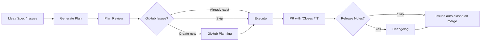

# PMP + GitHub Planning

An AI-agent-driven planning and execution system. Goes from idea to merged PR with full E2E test coverage and GitHub Issue tracking.

## How It Works

### The Lifecycle



Every transition between stages requires user confirmation. The agent never auto-advances.

## Detailed State Diagram

```mermaid
stateDiagram-v2
    [*] --> Brainstorm : idea / feature request
    [*] --> GeneratePlan : spec / roadmap provided
    [*] --> FetchIssues : GitHub issues / epic provided
    [*] --> PlanReview : existing plan file
    [*] --> SpecReview : "review specs" / architecture review
    [*] --> GitHubPlanning : "create issues" / "make epic"
    [*] --> SyncIssues : "update issues" / "sync issues"
    [*] --> TestOnly : "run tests" / "re-test"
    [*] --> Arc42 : "organize specs" / "arc42"

    state FetchIssues {
        [*] --> IdentifyEpic : issue URL / number
        IdentifyEpic --> FetchSubIssues : gh api graphql
        FetchSubIssues --> ParseIssueBodies
        ParseIssueBodies --> BuildRoadmap : normalize to feature specs
        BuildRoadmap --> PreFillIssueTable : issues already exist
        PreFillIssueTable --> [*]
    }

    FetchIssues --> GeneratePlan : issues fetched

    state Brainstorm {
        [*] --> Explore : read context
        Explore --> AskClarify
        AskClarify --> ProposeApproaches
        ProposeApproaches --> PresentDesign
        PresentDesign --> Refine
        Refine --> AskClarify : user wants changes
        Refine --> DesignDoc : user approves
        DesignDoc --> [*]
    }

    Brainstorm --> GeneratePlan : user confirms

    state GeneratePlan {
        [*] --> ReadRoadmap
        ReadRoadmap --> AnalyzeCodebase
        AnalyzeCodebase --> ClarifyRequirements
        ClarifyRequirements --> WritePlan
        WritePlan --> VerifyCoverage
        VerifyCoverage --> SavePlan
        SavePlan --> [*]
    }

    GeneratePlan --> PlanReview : user confirms

    state PlanReview {
        [*] --> ReadPlan
        ReadPlan --> ReadCode
        ReadCode --> SecurityGate
        SecurityGate --> ScoreChecklist
        ScoreChecklist --> ProduceReview

        ProduceReview --> UpdatePlan : user picks "update"
        ProduceReview --> Discuss : user picks "discuss"
        ProduceReview --> Approved : user picks "proceed"

        UpdatePlan --> ReadPlan : re-review
        Discuss --> ProduceReview : re-ask
        Approved --> [*]
    }

    PlanReview --> GitHubPlanning : user confirms
    PlanReview --> Execute : user declines issues

    state SpecReview {
        [*] --> MapCorpus
        MapCorpus --> ClassifyDocs
        ClassifyDocs --> ReadAllSpecs
        ReadAllSpecs --> ReconstructSystem
        ReconstructSystem --> DeepAnalysis
        DeepAnalysis --> ProduceReport

        ProduceReport --> DiscussFindings : user picks "discuss"
        ProduceReport --> ReviewDone : user picks "done"

        DiscussFindings --> ProduceReport : re-ask
        ReviewDone --> [*]
    }

    SpecReview --> [*] : report delivered

    state Arc42 {
        [*] --> MapCorpusArc42
        MapCorpusArc42 --> ClassifyIntoSections
        ClassifyIntoSections --> DetectDuplicatesArc42
        DetectDuplicatesArc42 --> ProposeStructure
        ProposeStructure --> AskUserArc42

        AskUserArc42 --> ExecuteReorg : user approves
        AskUserArc42 --> AdjustStructure : user adjusts
        AskUserArc42 --> AbortReorg : user rejects

        AdjustStructure --> ProposeStructure
        ExecuteReorg --> VerifyReorg
        VerifyReorg --> [*]
        AbortReorg --> [*]
    }

    Arc42 --> [*] : reorganized

    state GitHubPlanning {
        [*] --> DetermineTier
        DetermineTier --> PreFlight
        PreFlight --> CreateLabels
        CreateLabels --> CreateIssues
        CreateIssues --> RecordMapping : write to plan file
        RecordMapping --> [*]
    }

    GitHubPlanning --> Execute : user confirms

    state Execute {
        [*] --> SetupInfra : first run
        SetupInfra --> FeatureLoop

        state FeatureLoop {
            [*] --> TaskA_Impl : Task A
            TaskA_Impl --> RunUnitTests
            RunUnitTests --> UnitFixLoop : tests fail
            RunUnitTests --> CommitImpl : all pass
            UnitFixLoop --> RunUnitTests : fix applied
            UnitFixLoop --> Blocked : ceiling reached
            CommitImpl --> TaskB_E2E : Task B
            TaskB_E2E --> RunE2ETests
            RunE2ETests --> E2EFixLoop : tests fail
            RunE2ETests --> CommitE2E : all pass
            E2EFixLoop --> RunE2ETests : fix applied
            E2EFixLoop --> Blocked : ceiling reached
            CommitE2E --> CommentOnIssue : if GH issues exist
            CommentOnIssue --> [*]
            CommitE2E --> [*] : no GH issues
        }

        FeatureLoop --> FeatureLoop : next feature
        FeatureLoop --> FinalRun : all features done
        FinalRun --> CreatePR
        CreatePR --> PRClosesIssues : GH issues (Closes #N in body)
        PRClosesIssues --> UpdateFrontmatter
        CreatePR --> UpdateFrontmatter : no GH issues
        UpdateFrontmatter --> ArchivePlan : move to docs/plans/implemented/
        ArchivePlan --> [*]
    }

    state SyncIssues {
        [*] --> ReadPlanForSync
        ReadPlanForSync --> FetchCurrentIssues
        FetchCurrentIssues --> DiffBodies
        DiffBodies --> PresentDiff
        PresentDiff --> ApplySync : user approves
        ApplySync --> UpdateEpicBody
        UpdateEpicBody --> UpdatePlanTable
        UpdatePlanTable --> [*]
    }

    SyncIssues --> [*] : synced

    state Decompose {
        [*] --> ReadPlanForDecompose
        ReadPlanForDecompose --> BuildLayers : topological sort
        BuildLayers --> ApplyCohesion
        ApplyCohesion --> ProposePhases
        ProposePhases --> AdjustPhases : user adjusts
        ProposePhases --> InsertPhases : user approves
        AdjustPhases --> ProposePhases
        InsertPhases --> [*]
    }

    [*] --> Decompose : "decompose" / "phase this plan"
    Decompose --> [*] : phases inserted

    state Changelog {
        [*] --> ReadCompletedPlan
        ReadCompletedPlan --> ExtractFeatures
        ExtractFeatures --> CrossRefGit
        CrossRefGit --> GenerateNotes
        GenerateNotes --> PresentDraft
        PresentDraft --> SaveChangelog : user approves
        PresentDraft --> AdjustNotes : user adjusts
        AdjustNotes --> PresentDraft
        SaveChangelog --> [*]
    }

    [*] --> Changelog : "release notes" / "changelog"
    Execute --> Changelog : user opts in after completion

    TestOnly --> [*] : results reported

    Execute --> [*] : done
    Changelog --> [*] : notes saved
```



### Five Entry Points

| You say... | What happens |
|------------|--------------|
| "I have an idea for..." | **Workflow 1** -- Brainstorm → Plan → Plan Review → Execute |
| "Here's my roadmap/spec" | **Workflow 2** -- Plan → Plan Review → Execute |
| "Plan from epic #41" | **Workflow 4** -- Fetch Issues → Plan → Plan Review → Execute |
| "Review this plan" | **Workflow 3** -- Plan Review → Execute |
| "Review specs" / "Architecture review" | **Workflow 5** -- Architecture & Spec Review (standalone report) |

Plus standalone modes:

| You say... | What happens |
|------------|--------------|
| "Create issues for this plan" | GitHub Planning only (plan already exists) |
| "Update issues" / "Sync issues" | Sync Issues — diff plan against live issues, push changes |
| "Run E2E tests" | Test Only mode (no implementation) |
| "Decompose this plan" / "Break into phases" | Decompose — add phases to existing plan |
| "Generate release notes" / "Changelog" | Changelog — release notes from completed plan |
| "Organize specs" / "Arc42" | Arc42 — reorganize spec files into arc42 standard structure |

## The GitHub Integration

### Direction 1: Plan → Issues

After the agent generates and reviews a plan, it offers to publish it as GitHub Issues.

```
Plan approved
  → Agent determines complexity tier:
      SIMPLE (1-3 tasks)  → Single issue with checklist
      STANDARD (4-10)     → Epic + native sub-issues + milestone
      COMPLEX (10+)       → Epic + sub-issues + Projects v2 board
  → Creates issues with labels, verification criteria, and source context
  → Writes issue mapping table into the plan file
```

### Direction 2: Issues → Plan

A PM creates the epic and sub-issues in GitHub (manually or via the github-planning reference). Then tells the agent to plan from them.

```
PM creates Epic #41 with sub-issues #42, #43, #44
  → Agent fetches via `gh api graphql`
  → Parses issue bodies into feature specs
  → Generates full implementation plan with E2E tests
  → Pre-fills the GitHub Issues table (no need to create issues — they exist)
  → Normal review → execute flow
```

### How Issues Get Closed

Issues are **never manually closed**. The PR does it.

```
During execution:
  Feature committed → agent comments on issue with commit SHA
  ...

After all features pass:
  Agent creates PR with body:
    Closes #42
    Closes #43
    Closes #44
    Closes #41  ← the epic

PR merges → GitHub auto-closes all issues
```

## File Structure

```
pmp/
├── pmp/
│   ├── SKILL.md                            # Main skill — lifecycle router
│   ├── config.md                           # Central constants — paths, thresholds, labels, announcements
│   ├── references/
│   │   ├── overview.md                     # This file — lifecycle overview
│   │   ├── testing-approaches.md           # Per-project-type E2E guidance (shared)
│   │   └── spec-reviewer-prompt.md         # Agent team: spec reviewer (shared)
│   └── assets/
│       ├── github-issues-table.md          # Feature→Issue mapping table (shared)
│       ├── task.md                         # TDD task with steps
│       └── phase-exit-criteria.md          # Phase gate checklist
├── brainstorm/
│   ├── SKILL.md
│   ├── assets/
│   │   └── design-doc.md                   # Design document from brainstorm
│   └── references/
│       └── brainstorm.md                   # Collaborative design stage
├── plan/
│   ├── SKILL.md
│   ├── assets/
│   │   ├── plan.md                         # Full implementation plan structure
│   │   └── feature.md                      # Feature spec with ACs and E2E tests
│   └── references/
│       └── generate-plans.md               # Plan generation (+ GitHub Issues Mode)
├── review/
│   ├── SKILL.md
│   ├── assets/
│   │   ├── review-output.md                # Plan review verdict and findings
│   │   └── security-analysis-output.md     # Security analysis report
│   └── references/
│       ├── review.md                       # Plan review — skeptical senior engineer
│       └── security-analysis.md            # STRIDE + attack tree analysis
├── execute/
│   ├── SKILL.md
│   ├── assets/
│   │   ├── pr-body.md                      # Pull request body
│   │   └── e2e-test-spec.md                # Agent-driven test spec format
│   └── references/
│       ├── execute-loop.md                 # Code-test-fix loop with E2E + agent teams
│       ├── implementer-prompt.md           # Agent team: implementer
│       └── code-quality-reviewer-prompt.md # Agent team: code reviewer
├── github/
│   ├── SKILL.md
│   ├── assets/
│   │   ├── issue-simple.md                 # SIMPLE tier: single issue body
│   │   ├── issue-epic.md                   # STANDARD/COMPLEX: epic body
│   │   ├── issue-sub-issue.md              # Sub-issue body
│   │   ├── issue-task.md                   # Task issue body
│   │   ├── yaml-feature-form.yml           # GitHub Issue form: feature
│   │   ├── yaml-bug-form.yml               # GitHub Issue form: bug
│   │   └── yaml-epic-form.yml              # GitHub Issue form: epic
│   └── references/
│       ├── github-planning.md              # Issue/Epic/Project creation
│       └── sync-issues.md                  # Sync plan changes to existing issues
├── spec-review/                              # Orchestrator — runs discovery, dispatches sub-commands
│   ├── SKILL.md
│   ├── assets/
│   │   └── spec-review-output.md           # Consolidated report template
│   └── references/
│       ├── spec-review.md                  # Orchestrator logic — discovery + routing + remediation
│       └── discovery.md                    # Shared Phase 0-1 + context management
├── spec-architecture/                        # Sub-command: architecture quality
│   ├── SKILL.md
│   ├── assets/
│   │   └── spec-architecture-output.md     # Architecture report template
│   └── references/
│       └── spec-architecture.md            # Simplicity, consistency, invariants, state machines
├── spec-security/                            # Sub-command: security analysis
│   ├── SKILL.md
│   ├── assets/
│   │   └── spec-security-output.md         # Security report template
│   └── references/
│       └── spec-security.md                # STRIDE, attack simulation, AI red team
├── spec-operations/                          # Sub-command: operations analysis
│   ├── SKILL.md
│   ├── assets/
│   │   └── spec-operations-output.md       # Operations report template
│   └── references/
│       └── spec-operations.md              # Performance, resources, failures, scalability, operability
├── spec-implementability/                    # Sub-command: coding-readiness gate
│   ├── SKILL.md
│   ├── assets/
│   │   └── spec-implementability-output.md # Implementability report template
│   └── references/
│       └── spec-implementability.md        # 11-criteria production-readiness assessment
├── arc42/
│   ├── SKILL.md                            # Arc42 spec reorganization
│   ├── assets/
│   │   └── reorganization-report.md        # Reorganization proposal template
│   └── references/
│       ├── arc42.md                        # Reorganization algorithm
│       └── arc42-guide.md                  # Arc42 section guidance and tips
├── decompose/
│   ├── SKILL.md                            # Standalone plan phasing
│   └── references/
│       └── decompose.md                    # Phasing algorithm
└── changelog/
    ├── SKILL.md                            # Release notes generation
    ├── assets/
    │   └── changelog-output.md             # Release notes template
    └── references/
        └── changelog.md                    # Generation algorithm
```

---

> **Continued in [overview-reference.md](overview-reference.md)** — Assets, Plan File Anatomy, Key Principles, Prerequisites, Quick Start, and Changelog.
