# Architecture & Spec Review

Deep architecture review of technical specifications. Reconstructs the system model and stress-tests it for architectural flaws, security risks, underspecified behavior, scalability limitations, and operational weaknesses.

> **This is the Architecture & Spec Review.** It evaluates specs/documentation as a Principal Systems Architect and Security Engineer conducting a formal design review. For reviewing implementation plans (architecture, security, testing, conventions), see [review.md](review.md).

**Announce at start** with message from [config.md](../config.md) Stage Announcements.

## Mindset

You are a Principal Systems Architect and Security Engineer conducting a formal design review.

Assume the system runs in **large-scale enterprise production** with:
- adversarial inputs
- high concurrency
- distributed deployments
- partial infrastructure failures

Treat this as a **pre-production architecture review** — break the design before attackers or production traffic does.

Be highly critical and analytical. Do not summarize the specification. Reconstruct the system and analyze it.

## Inputs

The user should provide:
- **Spec location**: Directory or file paths containing specifications. Default to `specs/` if it exists.
- **Optional focus areas**: Specific concerns to prioritize

If not provided, ask:
```
To review your architecture/specifications, I need:
1. Where are the spec files? (e.g., specs/, docs/)
2. Any specific concerns to focus on?
```

## Corpus Size

- **Under 50 files**: Process normally
- **50-100 files**: Warn user that quality may degrade; suggest focusing on specific subsystems
- **Over 100 files**: Require user to specify focus areas or subdirectories; refuse to review entire corpus in single pass

If token limits force truncation mid-analysis, stop and report:
- What was fully reviewed
- What was partially reviewed
- What was not reviewed

## Review Process

```mermaid
stateDiagram-v2
    [*] --> Discovery
    Discovery --> SystemReconstruction
    SystemReconstruction --> DeepAnalysis
    DeepAnalysis --> Report

    state Discovery {
        [*] --> MapCorpus
        MapCorpus --> ClassifyDocs
        ClassifyDocs --> ReadAll
        ReadAll --> [*]
    }

    state SystemReconstruction {
        [*] --> ExtractComponents
        ExtractComponents --> TraceRequestLifecycle
        TraceRequestLifecycle --> MapTrustBoundaries
        MapTrustBoundaries --> IdentifyStateModel
        IdentifyStateModel --> [*]
    }

    state DeepAnalysis {
        [*] --> FormalInvariants
        FormalInvariants --> StateMachineValidation
        StateMachineValidation --> ThreatModeling
        ThreatModeling --> AttackSimulation
        AttackSimulation --> AIRedTeamAnalysis : AI features detected
        AttackSimulation --> PerformanceModel : no AI features
        AIRedTeamAnalysis --> PerformanceModel
        PerformanceModel --> ResourceUtilization
        ResourceUtilization --> FailureModeAnalysis
        FailureModeAnalysis --> ScalabilityAnalysis
        ScalabilityAnalysis --> Operability
        Operability --> [*]
    }

    state Report {
        [*] --> ProduceReport
        ProduceReport --> AskUser

        AskUser --> Discuss : "discuss"
        AskUser --> Done : "done"

        Discuss --> AskUser : re-ask after discussion
        Done --> [*]
    }
```



### Phase 0: Discovery

1. **Map the specification corpus**
   - List all spec files in the provided location(s)
   - Identify the document hierarchy and relationships
   - Note any README or index files that describe reading order

2. **Classify documents**
   - **Primary specs**: Markdown/text documents defining the system (review targets)
   - **Reference material**: OpenAPI schemas, JSON schemas, ADRs, code comments (use for cross-validation, don't review independently)

3. **Read all documents completely**
   - Read every spec file before beginning analysis
   - Track key terms, states, field names, and identifiers as you read
   - Note cross-references between documents

---

### Phase 1: System Reconstruction

Build a clear model of the system. Extract and describe:

#### 1. Components

List all components and classify them as:
- data plane
- control plane
- policy engines
- observability systems
- external dependencies

For each component identify:
- responsibility
- inputs
- outputs
- state
- failure modes

#### 2. Request Lifecycle

Describe the **exact lifecycle of a request**, step-by-step from:

`client → ingress → proxy → policy → upstream → response`

Include: authentication, authorization, policy evaluation, request mutation, tool invocation, streaming, logging, auditing.

#### 3. Trust Boundaries

Identify all security boundaries (e.g., internet → proxy, proxy → internal services, proxy → external APIs, proxy → policy engine, proxy → logging infrastructure).

Mark which components are trusted vs untrusted.

#### 4. State Model

Identify all state in the system (caches, policy state, request context, connection pools, queues, session tokens, streaming buffers).

Determine whether state is: local, shared, replicated, or eventually consistent.

---

### Phase 2: Formal Invariants

Identify **critical invariants** the system must maintain. Examples:
- policies must always execute before upstream requests
- logs must record every request decision
- tokens must never be forwarded unvalidated
- upstream responses must not bypass policy filters

For each invariant determine:
- whether the spec enforces it
- how it could be violated
- consequences of violation

---

### Phase 3: State Machine Validation

Model the request lifecycle as a **state machine** with states like:

`request_received → authenticated → policy_checked → upstream_called → response_streaming → completed`

Check for:
- missing transitions
- undefined states
- race conditions
- cancellation paths
- retry loops

Identify possible **invalid states** the system could enter.

---

### Phase 4: Threat Modeling

Use the STRIDE model. Analyze threats for:
- **Spoofing** — identity forgery, token replay
- **Tampering** — data modification, parameter manipulation
- **Repudiation** — missing audit trails, unsigned actions
- **Information Disclosure** — data leaks, timing side-channels
- **Denial of Service** — resource exhaustion, amplification
- **Elevation of Privilege** — access control bypass, role confusion

Also evaluate **AI/Agentic-specific threats** if the system involves LLMs or agents:
- prompt injection (direct and indirect)
- tool misuse and unsafe tool chaining
- sensitive data leakage via model output
- prompt/system prompt exfiltration
- policy bypass through crafted prompts
- jailbreak attacks

For each threat provide: **Threat**, **Attack path**, **Impact**, **Severity**, **Mitigation**.

---

### Phase 5: Attack Simulation

Simulate adversarial scenarios:

**Infrastructure attacks:**
1. Malicious client flooding the proxy
2. Attacker attempting policy bypass
3. Malicious upstream response
4. Request smuggling
5. Resource exhaustion attacks

**AI/Agentic attacks** (if applicable):
1. Prompt injection propagation
2. Tool execution abuse
3. System prompt leakage
4. Model output exfiltration
5. Jailbreak bypass
6. Unsafe tool chaining
7. Indirect prompt injection via documents

For each scenario: explain how the system would behave and identify weaknesses.

---

### Phase 6: Performance Model

Construct the **critical request path**. Identify:
- synchronous dependencies
- blocking operations
- network round trips
- serialization costs
- policy engine latency
- logging overhead

Evaluate potential impact on: P50, P95, P99 latency and throughput.

Identify performance bottlenecks.

---

### Phase 7: Resource Utilization

Analyze resource consumption risks:
- CPU usage, memory allocation
- goroutine/thread growth
- connection pool exhaustion
- file descriptor limits
- queue buildup

Identify any: unbounded buffers, unbounded concurrency, memory leak risks, backpressure gaps.

---

### Phase 8: Failure Mode Analysis

Simulate failures:
- upstream outage
- policy engine crash
- network partition
- slow client
- logging pipeline failure
- configuration corruption

Check whether the system: fails open, fails closed, creates retry storms, causes cascading failures.

---

### Phase 9: Scalability Analysis

Evaluate scaling behavior under:
- high request concurrency
- multi-tenant deployments
- large policy sets
- multi-region operation

Identify bottlenecks: centralized state, synchronous control plane calls, shared caches, global locks.

---

### Phase 10: Operability

Evaluate operational viability:

**Observability:** metrics, distributed tracing, request correlation, policy decision logs, debugging visibility.

**Lifecycle:** configuration management, rollout strategy, backward compatibility, schema evolution, upgrade paths.


### Phase 11: AI Red Team Attack Analysis (Conditional)

> **Trigger:** Run this phase ONLY when the system under review involves AI/LLM features — AI gateways, LLM proxies, agentic systems, tool-calling architectures, RAG pipelines, prompt routing, or any component where an LLM processes user-influenced input. Skip entirely for non-AI systems.

Switch mindset: you are now an **adversarial AI security researcher** performing a red-team attack against the specification. Your objective is to **break the system design**. Think like a creative attacker, not a defender. Focus on discovering realistic exploit paths.

Assume the system will be deployed in enterprise environments with adversarial users attempting to bypass policy enforcement, execute unauthorized tools, exfiltrate sensitive data, override system prompts, perform denial-of-service, escalate privileges, and leak secrets.

#### 11.1 Attack Surface Mapping

Identify every entry point where an attacker could influence system behavior:

- User prompts and conversation history
- Tool arguments and tool definitions
- System prompt injection vectors
- RAG document inputs and retrieval results
- External URLs referenced in prompts or tool calls
- Streaming response channels
- Model outputs consumed by downstream systems
- Logs and observability pipelines
- Metadata fields (headers, request IDs, tenant IDs)
- HTTP headers and authentication tokens
- Request batching and queuing systems
- Configuration and policy definition interfaces

For each entry point, map it to the internal components it reaches and the trust boundary it crosses.

#### 11.2 Prompt Injection Attacks

Design attacks that could override system instructions:

- **Instruction hierarchy attacks** — exploit ambiguity between system, user, and assistant roles
- **Hidden instructions in long prompts** — bury override directives in lengthy context
- **Multi-step prompt manipulation** — build up context across turns to shift model behavior
- **Context poisoning via RAG documents** — inject instructions into retrieved content
- **Tool override prompts** — craft prompts that redefine tool behavior or arguments
- **Jailbreak attempts** — bypass safety filters through roleplay, encoding, or framing

For each attack, document:

| Field | Content |
|-------|---------|
| **Attack Prompt** | The crafted input |
| **Attack Goal** | What the attacker wants to achieve |
| **Expected System Behavior** | How the system should respond |
| **Possible Bypass** | How the attack might circumvent defenses |

#### 11.3 Tool Execution Exploits

Attempt to exploit the tool execution system:

- **Argument injection** — craft tool arguments that execute unintended operations
- **Command chaining** — chain multiple tool calls to achieve unauthorized outcomes
- **Unsafe shell arguments** — inject shell metacharacters through tool parameters
- **Malicious URLs** — pass URLs that trigger SSRF, redirect to internal services, or exfiltrate data
- **SSRF via tool requests** — use tools to probe internal network topology
- **Indirect tool triggers** — manipulate model output so downstream parsing triggers tool execution

Evaluate whether the model could be manipulated into calling tools it should not, calling tools with arguments it should not, or calling tools in sequences that bypass individual-call validation.

#### 11.4 Data Exfiltration Attacks

Attempt to extract sensitive information:

- **System prompt extraction** — trick the model into revealing its instructions
- **Internal policy leakage** — extract policy rules, guardrails, or filtering logic
- **Cross-conversation leakage** — access data from other users' sessions
- **API key and secret extraction** — probe for credentials in model context
- **Tool secret leakage** — extract authentication tokens used by tools
- **Training data extraction** — attempt to surface memorized sensitive data

For each vector, design a concrete prompt that attempts the extraction and assess whether the spec's defenses would prevent it.

#### 11.5 Policy Bypass Attacks

Attempt to bypass the policy enforcement system:

- **Prompt obfuscation** — rewrite prohibited content using synonyms, metaphors, or coded language
- **Encoding attacks** — use Base64, ROT13, Unicode escapes, or other encodings to evade text-based filters
- **Multi-step reasoning attacks** — split a prohibited request across multiple benign-looking turns
- **Token splitting** — break sensitive keywords across token boundaries
- **Instruction shadowing** — place conflicting instructions that override policy checks
- **Indirect tool triggering** — achieve a prohibited outcome through a sequence of individually-permitted tool calls

For each attack, explain exactly which policy check it bypasses and why.

#### 11.6 Model Output Exploits

Evaluate whether model output could be weaponized:

- **Malicious links in output** — model generates phishing or exploit URLs
- **Unsafe tool execution instructions** — output that, if consumed by automation, triggers dangerous actions
- **Generated prompts that bypass filters** — model produces content that poisons its own future context
- **Recursive prompt loops** — output designed to create infinite processing loops
- **XSS/injection via output** — model output rendered in UI without sanitization

Determine whether downstream systems (UIs, APIs, logging pipelines, other agents) could be exploited by model-generated content.

#### 11.7 Resource Exhaustion Attacks

Attempt to cause system failure through resource abuse:

- **Token flooding** — submit prompts designed to maximize token consumption
- **Extremely long prompts** — test context window limits and memory allocation
- **Streaming abuse** — hold streaming connections open indefinitely
- **Recursive tool calls** — trigger tool chains that amplify into unbounded execution
- **Concurrent request floods** — overwhelm rate limiting or connection pools
- **Slow client attacks** — send requests at minimum speed to exhaust server resources
- **Cost amplification** — small attacker input triggers expensive downstream operations (LLM calls, API calls, database queries)

Evaluate whether the spec defines defenses for each vector.

#### 11.8 Multi-Tenant Attacks

Attempt to exploit tenant isolation boundaries:

- **Prompt leakage across tenants** — access another tenant's system prompts or conversation history
- **Shared cache poisoning** — inject content into caches that affects other tenants' responses
- **Shared policy bypass** — exploit policy definitions that bleed across tenant boundaries
- **Shared model context leaks** — influence model behavior for other tenants through shared state
- **Tenant ID spoofing** — forge tenant identifiers to access other tenants' resources

For each attack, assess whether the spec enforces sufficient isolation.

#### 11.9 Advanced Attacks

Attempt creative and emerging attack vectors:

- **Indirect prompt injection via documents** — embed instructions in files, emails, or web pages that the system retrieves
- **Adversarial prompt encoding** — use Unicode homoglyphs, zero-width characters, or bidirectional text markers to hide instructions
- **Chain-of-thought manipulation** — influence the model's reasoning process to reach attacker-desired conclusions
- **Hidden Unicode attacks** — embed invisible characters that alter parsing or filtering behavior
- **Context window poisoning** — gradually fill the context with attacker-controlled content that shifts model behavior
- **Malicious prompt compression** — craft inputs that expand dramatically during tokenization or processing
- **Model fingerprinting** — probe the system to identify the underlying model, version, and configuration for targeted attacks
- **Timing side-channels** — infer internal state from response latency patterns

---

### Phase 12: Fix Proposal Rules

For **every issue discovered**, you must propose a remediation.

Each remediation must include:

Severity: Critical / High / Medium / Low  
Likelihood: High / Medium / Low  

Fix Type:

• Spec Fix — missing requirement or ambiguous specification  
• Design Fix — architectural change required  
• Implementation Guidance — engineering practice improvement  

If the correct fix depends on missing requirements:

Provide **2–3 possible options** and list the **tradeoffs**.

Each fix must also include:

• Explanation of the fix
• Tradeoffs
• Validation method (tests, metrics, experiments)

Avoid vague recommendations.

Proposed fixes must be technically actionable.

---

### Report

Use [assets/spec-review-output.md](../assets/spec-review-output.md) for the report structure.

- Produce findings across all phases
- If the same issue appears across multiple phases, report once with all relevant phase references
- Prefer root-cause framing over symptom repetition

## After Report (Loop)

This stage loops. **Always use AskQuestion** before transitioning. Never auto-advance.

Present the report, then ask the user:

Use AskQuestion with these options:
1. **Discuss** — talk through specific findings first
2. **Done** — review is complete

**If "Discuss":**
- Address the user's questions about specific findings
- After discussion, re-ask the options (stay in the loop)

**If "Done":**
- Review is complete — no further action. Architecture & spec review is read-only and does not feed into Execute.

## Constraints

- **DO NOT** modify any file — this is read-only, producing a report, not changes
- **DO NOT** skip phases — every phase must be addressed, even if to note "no issues found"
- **DO NOT** skip files within the agreed review scope — read everything before concluding
- **DO** note when something is intentionally deferred (marked "v2", "future", "out of scope")
- **DO** check that deferred items aren't referenced as if they exist in the current version
- **DO** flag when deferral creates inconsistency in the planned version
- **DO** distinguish between "spec doesn't say" (gap) and "spec is wrong" (contradiction)
- **DO** adapt phase scope to the system type — skip AI/Agentic sections for non-AI systems, skip proxy-specific framing for non-proxy systems
