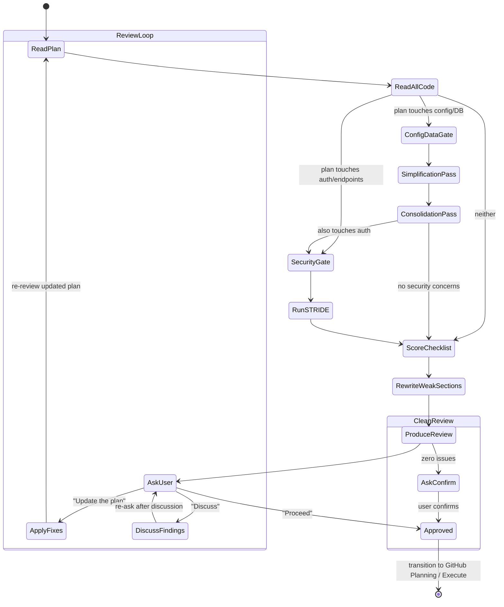

# Plan Review

Critically review implementation plans. Treat every plan as if submitted by a junior developer.

> **This is the Plan Review.** It evaluates implementation plans for quality, completeness, security, and adherence to project conventions. For reviewing technical specifications (finding inconsistencies, gaps, contradictions), see [spec-review.md](../../spec-review/references/spec-review.md).

**Announce at start** with message from [config.md](../../pmp/config.md) Stage Announcements.

## The Review Mindset

You are a skeptical senior engineer. Do NOT:
- Trust assumptions — verify with code
- Accept vague descriptions — demand specifics
- Rubber-stamp anything — find what's wrong
- Be sycophantic — honest feedback over politeness

You MUST:
- Read ALL referenced code files completely
- Challenge design decisions
- Look for simpler alternatives
- Improve weak sections directly — return a better plan, not just feedback

## Review Checklist

Create a TodoWrite with these items and check each:

### Architecture & Design
- [ ] Approach aligns with existing patterns (check CLAUDE.md architecture)
- [ ] No unnecessary complexity — simpler alternatives considered
- [ ] Proper separation of concerns
- [ ] No circular dependency risks
- [ ] Changes fit the existing file layout

### Security
- [ ] Input validation addressed for every new input
- [ ] Auth boundaries properly defined
- [ ] Secret handling follows existing patterns (check CLAUDE.md for project conventions)
- [ ] Injection risks identified and mitigated
- [ ] Attack surface changes documented
- [ ] **Deep security analysis completed** — read [security-analysis.md](security-analysis.md) and run the full STRIDE + attack tree analysis for plans touching auth, data flows, new endpoints, logic, best practices or secrets

### Testing
- [ ] Every atomic change has tests
- [ ] Edge cases identified and covered
- [ ] TDD flow specified (red-green cycle)
- [ ] Integration tests in final phase only
- [ ] Verification commands include expected output
- [ ] **E2E testing check** — does the plan include end-to-end tests? If not, ask the user whether E2E tests should be added. Consider:
  - User-facing flows that cross multiple components or services
  - Critical paths (auth, payments, data pipelines) that break silently without E2E coverage
  - If the user opts to include E2E tests, add an E2E testing phase to the plan with specific scenarios, tooling, and pass/fail criteria

### Config & Data Changes
- [ ] Config file changes identified (env vars, YAML, TOML, JSON configs)
- [ ] New config values have defaults or are documented as required
- [ ] **Config simplification review** — can any config keys be renamed to be more intuitive? Can related keys be grouped or merged to reduce cognitive load? Present options to the user:
  - Keys with cryptic/abbreviated names → suggest clearer names
  - Redundant or overlapping keys → suggest merging
  - Flat structures that would benefit from nesting (or vice versa)
  - Boolean flags that could be replaced by a single enum/mode selector
- [ ] Database schema changes identified (new tables, columns, indexes, constraints)
- [ ] **Table consolidation review** — can any new or existing tables be merged? Look for:
  - 1:1 relationships that should be a single table
  - Tables that share most columns and differ only by a "type" discriminator
  - Lookup/reference tables with very few rows that could be an enum or constant
  - Junction tables that carry no extra data and could be embedded as arrays/JSON
  - If consolidation is possible, present the user with options: (A) keep separate tables with justification, (B) merge with specific schema, (C) hybrid approach
- [ ] Migrations created for every schema change (up AND down/rollback)
- [ ] Migration ordering and dependencies are correct
- [ ] Existing data compatibility addressed (nullable columns, default values, backfills)
- [ ] Migration is idempotent or guarded against re-runs
- [ ] Rollback plan tested — down migration restores previous state without data loss

### Completeness
- [ ] Phase exit criteria are specific and automated
- [ ] File paths are exact (not approximate)
- [ ] Out of scope section exists (prevents scope creep)
- [ ] No unresolved questions or TODOs

### Conventions
- [ ] Plans in correct directory (see [config.md](../../pmp/config.md) File Paths)
- [ ] Commit messages follow format (see [config.md](../../pmp/config.md) Commit Conventions)
- [ ] Detected CI command as verification gate
- [ ] Complexity within project-appropriate limits
- [ ] Branch from detected integration branch (never `main` unless it IS the integration branch)

## Review Process

1. **Read the plan completely**
2. **Read ALL referenced code files** — use agent teams for parallel reading if many files
3. **Config & data gate:** If the plan adds/modifies config files or database schemas:
   - Verify migrations exist for every schema change, rollback is covered, and new config values have sensible defaults or are flagged as required
   - **Simplification pass:** Review all config keys touched by the plan — flag cryptic names, redundant keys, or structures that increase cognitive load. Propose clearer alternatives and present options to the user
   - **Consolidation pass:** Review all tables touched or created by the plan — identify 1:1 relationships, type-discriminated duplicates, or thin lookup tables that could merge. Present consolidation options to the user with trade-off analysis
4. **Security gate:** If the plan touches auth, data flows, new endpoints, or secrets — read [security-analysis.md](security-analysis.md) and run the full analysis. Append findings to the review output
5. **Score each checklist item** — pass, fail, or needs-work
6. **For each failure:** explain why and provide a specific fix
7. **Rewrite weak sections** — don't just flag problems, fix them
8. **Produce the improved plan** or list of required changes

## Output Format

Use [assets/review-output.md](../assets/review-output.md) for the review report structure.

## After Review (Loop)

This stage loops. **Always use AskQuestion** before transitioning. Never auto-advance.

### When findings exist

Present the review, then ask the user:

Use AskQuestion with these options:
1. **Update the plan** — incorporate review findings into the plan
2. **Proceed to implementation** — move forward as-is
3. **Discuss** — talk through specific findings first

**If "Update the plan":**
1. Re-read the current plan file
2. Apply ALL review findings — critical, important, and minor — directly into the plan:
   - Rewrite flagged sections with the fixes from the review
   - Add missing items identified in the review
   - Incorporate accepted config simplification and table consolidation choices
   - Update migration steps if schema changes were revised
   - Update phase exit criteria to reflect any new requirements
3. Mark the plan with a `## Review Log` section at the bottom recording what changed and when
4. Present the updated plan to the user
5. **Re-run review** on the updated plan (loop back to the top of this stage)

**If "Discuss":**
- Address the user's questions
- After discussion, re-ask the same three options (stay in the loop)

**If "Proceed to implementation":**
- Continue to the transition step below

### When review is clean (APPROVED, zero issues)

Ask the user: "Plan looks good — no issues found. Ready to proceed to implementation?"
- Wait for confirmation before advancing

### Transition to Execute

Only after the user explicitly says to implement/execute:
1. **Update frontmatter:** Set `status: reviewed` and `reviewed_at` to the current UTC timestamp in the plan file (see [config.md](../../pmp/config.md) Plan Frontmatter)
2. Read [execute-loop.md](../../execute/references/execute-loop.md) and follow it
3. Do NOT start implementation without user confirmation
