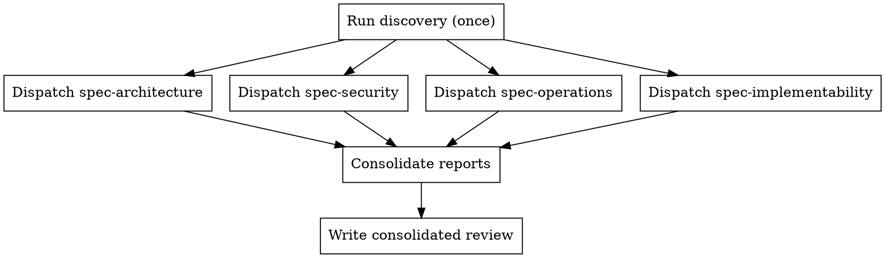

# PMP: Spec Review — Orchestrator

**Announce at start:** "Using pmp:spec-review to analyze specifications."

Full architecture & specification review. Runs discovery once, dispatches four focused sub-commands, consolidates findings into remediation, and produces a unified report.

Standalone workflow — does not feed into plan generation or execution.

## Orchestration Flow

## Agent Readability Gate

Specs are the input to plan generation. A spec that is ambiguous, incomplete, or relies on implicit knowledge will produce plans that coding agents misinterpret. This gate runs as part of consolidation — after all four sub-commands report.

**Evaluate the spec corpus for:**

| Check | What to look for | Fail if |
|-------|-----------------|---------|
| **Deterministic behavior** | Every feature, rule, and constraint has exactly one interpretation | Spec uses "should", "may", "optionally", "as appropriate" without defining the condition |
| **Complete interface contracts** | Every API, function, event, and data flow has full input/output/error specs | Schemas say "additional fields as needed" or omit error responses |
| **Concrete thresholds** | Every limit, timeout, rate, and boundary is a specific number with units | Spec says "reasonable timeout", "appropriate limit", "sufficient capacity" |
| **Explicit defaults** | Every optional parameter, config key, and setting has a stated default value | Default is "implementation-defined" or unstated |
| **No forward references to unwritten specs** | Every cross-reference points to an existing, readable document | Spec says "see [future doc]", "TBD", "to be specified", or links to non-existent files |
| **Conflict-free** | No two spec documents define the same behavior differently | Same concept has different names, different constraints, or contradictory rules across files |
| **Machine-parseable structure** | Headings, lists, and tables follow consistent patterns an agent can navigate | Prose paragraphs embed critical requirements that an agent scanning for headings would miss |
| **Self-contained features** | Each feature spec can be implemented without reading unrelated specs | Feature spec says "works like feature X" or "same pattern as Y" without restating the pattern |

**For each failure:** include in the consolidated report with severity, file location, and a concrete rewrite suggestion.

## Sub-Commands

For focused analysis, invoke sub-commands directly:

| Sub-Command | Focus |
|-------------|-------|
| `/pmp:spec-architecture` | Simplicity, consistency, determinism, invariants, state machines |
| `/pmp:spec-security` | STRIDE threat modeling, attack simulation, AI red team |
| `/pmp:spec-operations` | Performance, resources, failure modes, scalability, operability |
| `/pmp:spec-implementability` | 13-criteria production-readiness gate (includes agent compliance) |

## Workflow

1. **REQUIRED:** Read [config.md](../pmp/config.md) for current constants
2. **REQUIRED:** Check the analysis cache FIRST — see [analysis-cache.md](../pmp/references/analysis-cache.md)
3. **REQUIRED:** Read [spec-review.md](references/spec-review.md) and follow it — orchestrates discovery, sub-commands, remediation, and report
4. Loops on discussion until user says "done"

## Key References

- Orchestration logic: [spec-review.md](references/spec-review.md)
- Shared discovery: [discovery.md](references/discovery.md)
- Report template: [spec-review-output.md](assets/spec-review-output.md)

## Shared Resources

- Full lifecycle overview: [overview.md](../pmp/references/overview.md)
