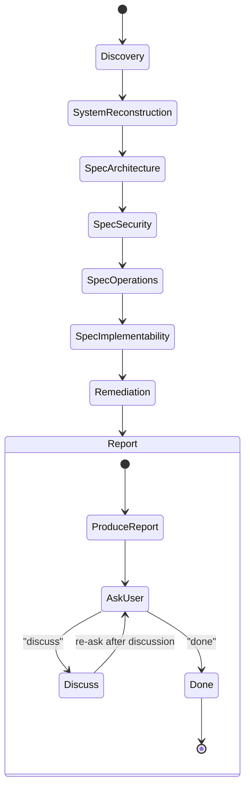

# Architecture & Spec Review — Orchestrator

Full architecture and specification review. Runs discovery once, dispatches focused sub-commands for analysis, consolidates findings into remediation, and produces a unified report.

> **This is the Spec Review Orchestrator.** It coordinates four focused sub-reviews: architecture, security, operations, and implementability. Each sub-command can also be invoked standalone. For reviewing implementation plans, see [review.md](../../review/references/review.md).

**Announce at start** with message from [config.md](../../pmp/config.md) Stage Announcements.

## Mindset

You are a Principal Systems Architect and Security Engineer conducting a formal design review.

Your objective is to **improve the architecture**, not merely summarize it.

Assume the system runs in **large-scale enterprise production** with:
- adversarial inputs
- high concurrency
- distributed deployments
- partial infrastructure failures

Treat this as a **pre-production architecture review** — break the design before attackers or production traffic does.

Aggressively identify opportunities to:
- simplify the design
- eliminate ambiguity
- improve determinism
- remove unnecessary complexity
- enforce architectural consistency
- improve reliability and testability

Be highly critical and analytical. Do not summarize the specification. Reconstruct the system and analyze it.

### Review Principles

When reviewing the spec, prioritize:

1. **Simplicity over extensibility** — remove what isn't needed before adding flexibility
2. **Determinism over flexibility** — predictable behavior beats configurable behavior
3. **Explicit behavior over implicit behavior** — no hidden defaults, no magic
4. **Strong boundaries over shared state** — clear ownership, minimal coupling
5. **Operational clarity over theoretical purity** — optimize for debugging, not elegance

## Inputs

The user should provide:
- **Spec location**: Directory or file paths containing specifications. Default to `specs/` if it exists.
- **Optional focus areas**: Specific concerns to prioritize

If not provided, ask:
```
To review your architecture/specifications, I need:
1. Where are the spec files? (e.g., specs/, docs/)
2. Any specific concerns to focus on?
```

## Corpus Size

- **Under 50 files**: Process normally
- **50-100 files**: Warn user that quality may degrade; suggest focusing on specific subsystems
- **Over 100 files**: Require user to specify focus areas or subdirectories; refuse to review entire corpus in single pass

If token limits force truncation mid-analysis, stop and report:
- What was fully reviewed
- What was partially reviewed
- What was not reviewed

## Review Process



## Orchestration

1. Read [config.md](../../pmp/config.md) for current constants
2. Read [discovery.md](discovery.md) and execute **Phase 0 (Discovery)** and **Phase 1 (System Reconstruction)**
3. **Check SSoT compliance** — verify spec files follow [single-source-of-truth.md](../../pmp/references/single-source-of-truth.md) formatting rules (summary blocks, cross-references, naming, deduplication). Flag violations as findings in the report.
4. Dispatch sub-commands sequentially. Each sub-command runs its analysis phases using the system model and file contents already in context:

   | Step | Sub-Command | Reference | Phases |
   |------|------------|-----------|--------|
   | 4a | Architecture | [spec-architecture.md](../../spec-architecture/references/spec-architecture.md) | Simplicity, Consistency, Invariants, State Machines |
   | 4b | Security | [spec-security.md](../../spec-security/references/spec-security.md) | Threat Modeling, Attack Simulation, AI Red Team |
   | 4c | Operations | [spec-operations.md](../../spec-operations/references/spec-operations.md) | Performance, Resources, Failure Modes, Scalability, Operability |
   | 4d | Implementability | [spec-implementability.md](../../spec-implementability/references/spec-implementability.md) | 11-criteria production-readiness gate |

5. **Consolidate findings** — deduplicate across sub-commands (same root cause reported by multiple sub-commands → report once with all phase references)
6. Run **Remediation** (see below) — cross-references all findings
7. Assemble merged report using [spec-review-output.md](../assets/spec-review-output.md)
8. Save report to reviews directory per [config.md](../../pmp/config.md) File Paths

### Remediation

For **every issue discovered** across all sub-commands, propose a remediation.

Each remediation must include:

Severity: Critical / High / Medium / Low
Likelihood: High / Medium / Low

Fix Type:

- Spec Fix — missing requirement or ambiguous specification
- Design Fix — architectural change required
- Implementation Guidance — engineering practice improvement
- Simplification — component removal, consolidation, or boundary adjustment

If the correct fix depends on missing requirements:

Provide **2-3 possible options** and list the **tradeoffs**.

Each fix must also include:

- Explanation of the fix
- Tradeoffs
- Validation method (tests, metrics, experiments)

Avoid vague recommendations.

Proposed fixes must be technically actionable.

#### Architecture Refactoring Suggestions

Beyond individual fixes, propose structural improvements when warranted:
- modules that should be merged or split
- pipeline stages that should be reordered, consolidated, or eliminated
- configuration models that should be simplified
- unnecessary extensibility points that should be removed
- dependency directions that should be reversed

#### Suggested Revised Architecture (Optional)

If major improvements are possible, propose a **cleaner architectural structure**:
- component diagram (text form) showing simplified topology
- revised pipeline model with consolidated stages
- improved module boundaries with clear ownership
- before/after comparison highlighting what was removed or simplified

Only include this section when the changes are substantial enough to warrant a redesign sketch. Minor improvements should stay in the per-issue remediations.

### Report

Use [spec-review-output.md](../assets/spec-review-output.md) for the report structure.

Save the report to the reviews directory defined in [config.md](../../pmp/config.md) File Paths, using the review filename pattern (`YYYY-MM-DD-<architecture>-review.md`). Create the directory if it doesn't exist. The `<architecture>` slug should be a short, kebab-case identifier for the system or component under review (e.g., `2025-03-11-auth-gateway-review.md`).

- Produce findings across all phases
- If the same issue appears across multiple phases, report once with all relevant phase references
- Prefer root-cause framing over symptom repetition

## After Report (Loop)

This stage loops. **Always use AskQuestion** before transitioning. Never auto-advance.

Present the report, then ask the user:

Use AskQuestion with these options:
1. **Discuss** — talk through specific findings first
2. **Done** — review is complete

**If "Discuss":**
- Address the user's questions about specific findings
- After discussion, re-ask the options (stay in the loop)

**If "Done":**
- Review is complete — no further action. Architecture & spec review is read-only and does not feed into Execute.

## Constraints

- **DO NOT** modify any file — this is read-only, producing a report, not changes
- **DO NOT** skip sub-commands — every sub-command must be addressed, even if to note "no issues found"
- **DO NOT** skip files within the agreed review scope — read everything before concluding
- **DO** note when something is intentionally deferred (marked "v2", "future", "out of scope")
- **DO** check that deferred items aren't referenced as if they exist in the current version
- **DO** flag when deferral creates inconsistency in the planned version
- **DO** distinguish between "spec doesn't say" (gap) and "spec is wrong" (contradiction)
- **DO** adapt phase scope to the system type — skip AI/Agentic sections for non-AI systems, skip proxy-specific framing for non-proxy systems
